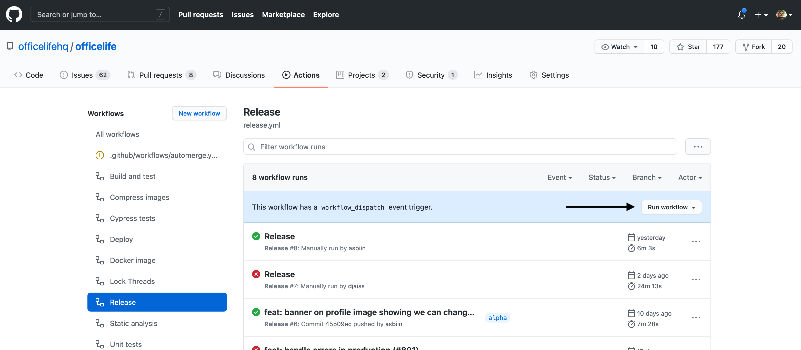

# Deployment process

## Overview

OfficeLife is deployed automatically on each commit in the `main` branch in two environments:

* https://beta.officelife.io
* https://demo.officelife.io

We plan to disable this in the future to control which environment has which version, but for now, every single commit is pushed to production instantly.

## Create a release

OfficeLife uses [semantic-release](https://semantic-release.gitbook.io/semantic-release/) to manage releases.

It allows to create new releases based on the history of modifications since last release, and create a patch/minor/major release depending on some rules.

There are two ways to create a new release: create a pre-release or an official release.

### Create a pre-release

You can create a pre-release by pushing the main branch to one of these breanches:
  - next
  - next-major
  - beta
  - alpha

This will create a new GitHub pre-release.

### Create an official release

To create an official release (on main branch), go to [`Actions` > `Release`](https://github.com/officelifehq/officelife/actions/workflows/release.yml), then run the workflow against the main branch, as shown below:

## Steps

When a new release is created, semantic-release rules described in the [`.releaserc`](https://github.com/officelifehq/officelife/blob/main/.releaserc) file are applied.

| Plugin | Description |
|--------|-------------|
| `@semantic-release/commit-analyzer` | Analyse commit history to determine the next release version. |
| `@semantic-release/release-notes-generator` | Generates the release note content. |
| `@semantic-release/changelog` | Write down the release note in the `CHANGELOG.md` file. |
| `semantic-release-github-pullrequest` | Create a pull request on the main branch to update the updated `CHANGELOG.md` file.|

The actions that will be run by the whole workflow are:

1. semantic-release creates a new release in GitHub
2. a pull request is created on the `main` branch to update the `CHANGELOG.md` file
3. a package is built with all the dependencies and assets, which are uploaded as the release's asset files.
