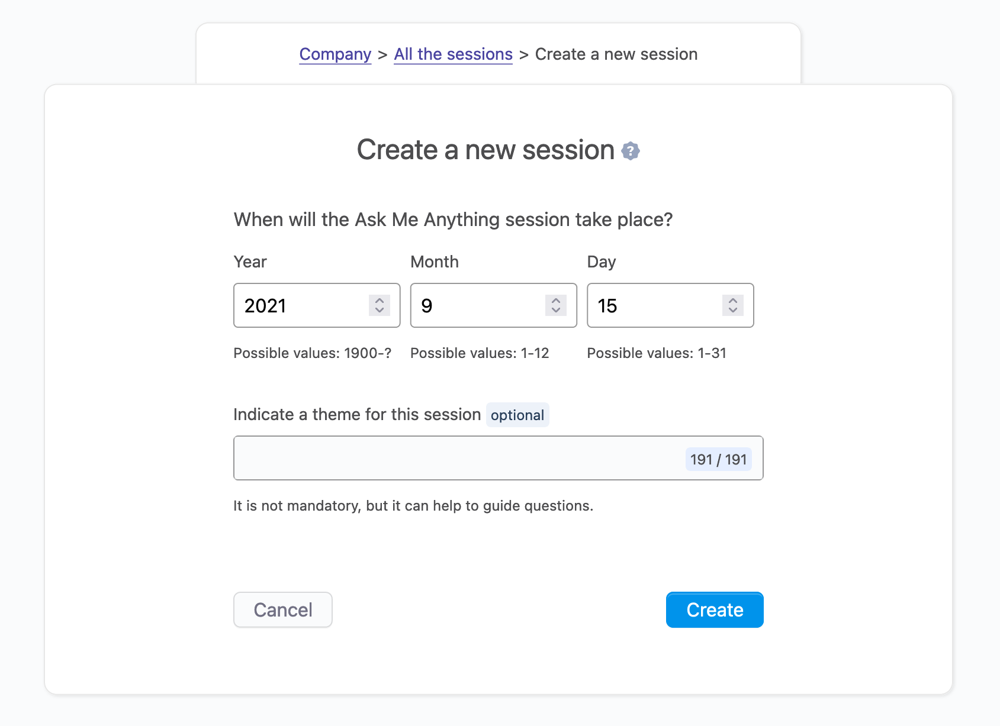
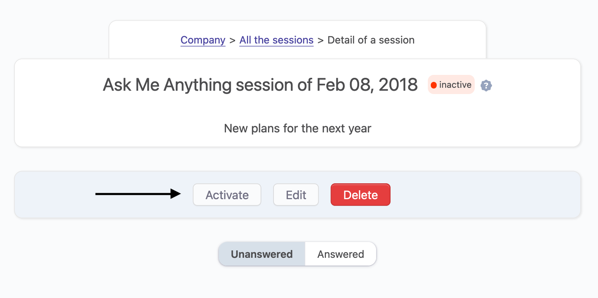
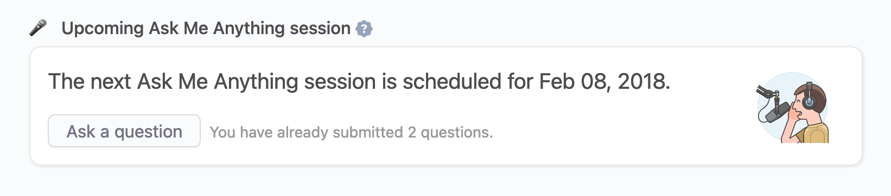
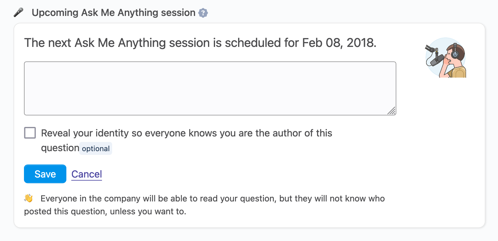
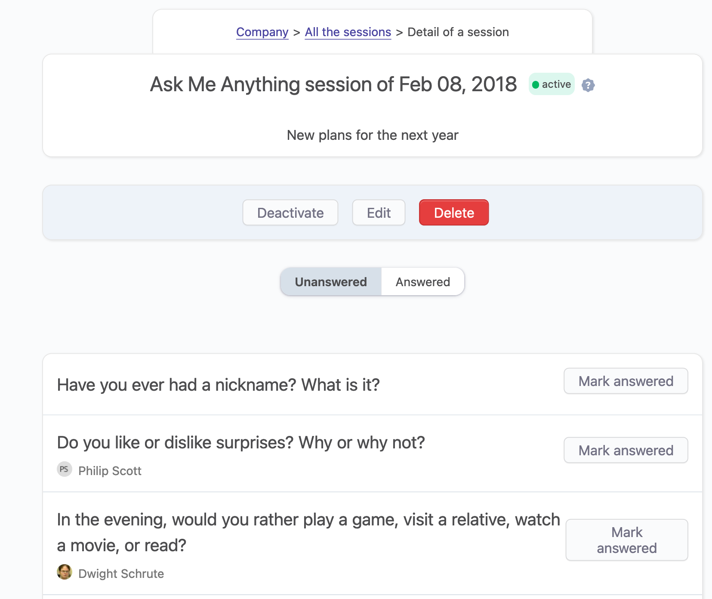

# Ask me anything sessions

## Overview

An AMA, short for “ask me anything,” is a type of interactive session in which someone answers questions from an audience. Sometimes, these questions are anonymous, sometimes they are not.

AMA sessions are more and more popular in companies as they allow companies to be transparent, and let employees ask difficult questions.

OfficeLife makes it easy to create AMA sessions. Those sessions can be either done in real life or online. It's super simple to set up an Ask Me Anything session:

1. First, you need to set the date of the next iteration of the session. It has to be, obviously, in the future.
2. You can define a theme, optionally.
3. Once the new AMA session is planned, everyone in the company will receive, on their dashboard, the notification about it. At this stage, every employee will have the opportunity to submit a question that will have to be answered during the AMA session. This question can be anonymous, if needed.
4. When the AMA happens, the host will be able to use OfficeLife to show the questions that need an answer, and mark a question as "answered". At this stage, everyone in the company will be able to see all the questions.

And that's it!

## Creating a session

Creating a session happens under the Company > Human resources tab.

A session only needs a date to be created. You can also specify a theme if you need, but it's not mandatory. If provided, the theme will be displayed everywhere the session is displayed. This can guide employees to ask relevant question to the theme of the session.

Ideally, the date that we provide is in the future. However you can set the date in the past if you want.

By default, when a session is created, it's not yet active - meaning it won't be shown to every employee.

::: tip Rules
* Only the date is mandatory.
* The theme is optional, but if provided, is limited to 191 characters.
* Only employees with the HR or administrator roles can create a new session.
:::

### Activating a session

By default, a session is not active once it's created. To activate a session, head over to the session and click on the Activate button.

Activating the session will have three consequences:

- the session will appear on the dashboard of every single employee,
- it will also appear on the Company > HR tab,
- every single employee, regardless of their permissions, will be able to submit questions.

Only one session can be active at any given time. If you activate a session while another was active, the latter will be marked as inactive.

### Once a session is over

Once the session has taken place, and all questions answered, you can simply deactivate the session and it will disappear from the employee's dashboard.

## Asking a question

When a session is active, any employee can ask one or more questions ahead of the session, so it can be answered during the session.

This question can be anonymous or not - it's up to the employee to decide to reveal its identity. If the question is anonymous, no one in the company, regardless of the permissions, will know the identity of the person who submitted the question.

To submit a question, the only way is to go on your dashboard. When a session is active, this is what you see:

When we click on the Ask a question button, here is what we'll see:

By default, the question is anonymous, so it's really up to the employee to reveal her identity.

::: tip Rules
* Any employee can submit a question.
* Employees can submit any number of questions for a single session.
* The question is mandatory and is limited to 191 characters.
* Questions that were submitted, can not be deleted, by anyone.
:::

## During a AMA session

An Ask Me Anything session is all about people asking questions. So when the session occurs, remotely or in person, the person in charge of answering questions has to have a list of all the questions he needs to answer.

You can find the list of sessions in the Company > HR tab, and when you click on the details of a given session, here is what we'll see:

Those information are displayed:

- the scheduled date of the session,
- the theme, if defined,
- and all the questions that were asked prior to the session.

If you have the HR or administrator permission, you can mark each question as answered. Once answered, it will disappear from the main list, and will ended on the Answered tab.

The Answered tab will list of the questions that were answered during the session.