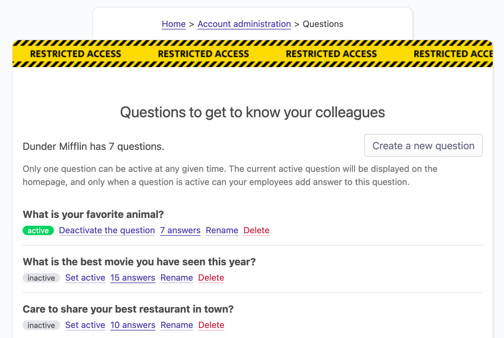
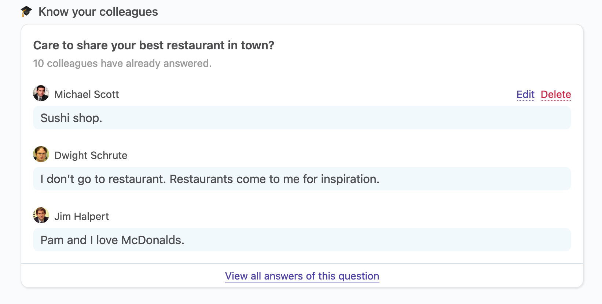

# Get to know your colleagues

## Overview

At OfficeLife, we believe that it's really important to bond with your colleagues. One of the way to bond with someone is to know a little bit of personal information, especially in a remote context.

When we are eating with colleagues, it's always fun to talk about the latest movies we've seen, or what we did last week end, or what we like in general.

OfficeLife lets employees ask questions that every other employee will be able to answer, and that everyone will be able to read. This is a fun way to know more about your colleagues.

## Creating a question

Under Adminland, employees with the HR or administrator roles are able to create a question.

::: tip Rules
* To create a question, only the name of the question is required.
* The question is mandatory and limited to 255 characters.
* By default, when a question is created, it's inactive by default - that means employees won't be able to see it right away.
:::

## Managing questions

Questions are managed in Adminland. On this screen, questions are listed by creation date (newest at the top).

Here, questions can be:

* activated or deactivated,
* renamed,
* or deleted.

### Active state

Only one question can be active at a time. What does active mean? It means that this is the question that will appear on the dashboard of all the employees.

If no question is active in the company, nothing will appear on the dashboard.

### Deletion of questions

If you delete a question, we'll immediately delete all the answers linked to the question.

## Letting employees answer question

When a question is active, it will appear on the dashboard of every single employee of the company.

There are two use cases here:

* the employee hasn't replied to the question yet,
* the employees has already replied to the question.

Let's analyze these two use cases.

### The employee hasn't replied yet

In this case, the employee only sees the question that is being asked.

As you can see on the screenshot above, along with the question, OfficeLife indicates the number of employees who have already answered. However, in order not to influence the answer, all the other answers are hidden for now, until the employee replies.

::: tip Rules
* The answer supports Markdown and is to 65555 characters.
* Everyone can see the answer once it's submitted.
:::

### The employee has replied

As soon as an employee replies, (s)he will be able to see a bunch of answers that other employees have already submitted. There is also a link to see the list of all the answers, if the employee wants to know more.

The employee can see his/her own answer on this view, and can edit the answer or delete it.

## View the list of all the questions

### On the Company tab

Employees can see the list of all questions that have ever been submitted in the Company tab.
