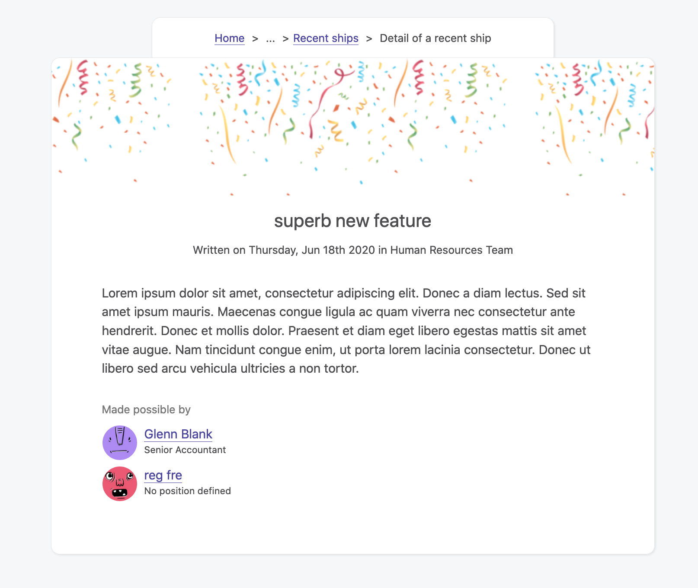
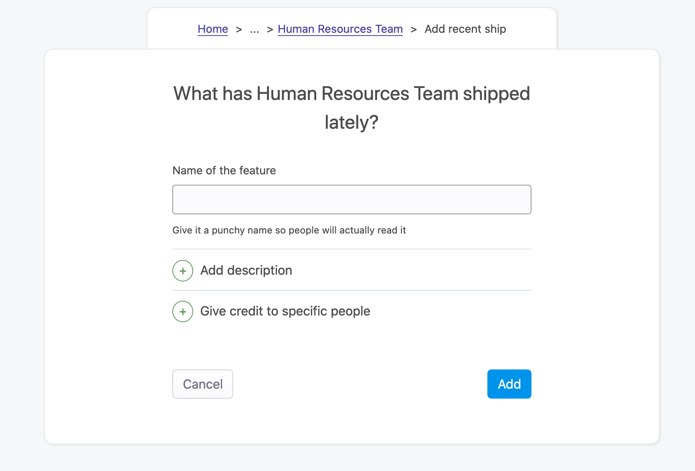
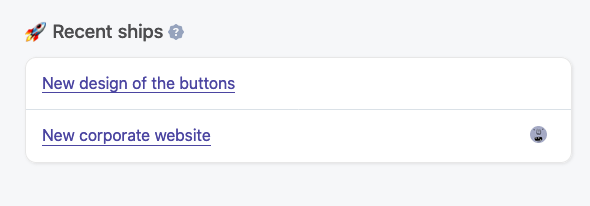
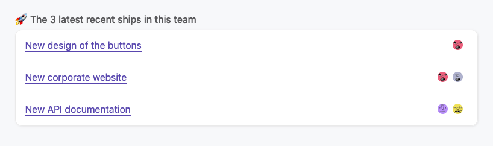

# Recent ships

## Overview

Teams are there to accomplish something. Nothing is worse than people doing something without telling their peers in the company. This leads to miscommunication, doubt and sometimes suspicion. OfficeLife wants to encourage collaboration and communication throughout the entire company. This is where the Recent ships feature comes into play.

When a team accomplishes something, for instance finalize a big project or ship a great feature, it should tell the entire company about it. We call it `Recent ships`.

Anyone in the team can create an entry in the Recent ships log. When an entry is created, it will be public for the entire company to see and will appear in those places:

* on the team page itself,
* on the main Company tab accessible from the header of the application,
* on the Team tab on the dashboard,
* on the Company tab on the dashboard.

When an entry is associated to specific people, it will also appear on the Employee profile page as well.

This is how the details of an entry looks like:

## Creating an entry

Creating a Recent ship entry takes place on the Team page itself. Anyone in the team can create an entry. The entry will be visible by the entire company and can always be edited or deleted anytime.

When creating an entry, you can choose to associate specific people in the team with this entry. If specific people are provided, this entry will also appear on the profile page of each one of these employees. Each employee associated with an entry will also get a notification so (s)he’s aware that (s)he’s been flagged as someone who contributed to something great.

You can associate employees from another team as well if you so desire, as sometimes, people from other teams can contribute to ship features. In that case, the entry will still be associated with the original team.

::: tip Rules
* An entry can be created by someone with either the HR or administrator role, or someone who is part of the team.
* The title of the entry is mandatory and limited to 255 characters.
* The description is optional, supports Markdown and is to 65555 characters.
* Associating an entry to a specific employee is optional.
:::

## Deleting an entry

HR and administrators can delete an entry that was previously created.

When an entry is deleted, notifications that employees received if they were associated with it will not be removed from their notifications center.

::: tip Rules
* An entry can be deleted by someone with either the HR or administrator role
:::

## Recent ships on the employee profile page

The recent ship entries will be displayed on the employee’s profile page when the employee is associated with this entry.

For now, all entries are displayed - we don't limit the number of entries that should appear here. We might revisit this in the future to include a "View all" so we can display something like 3 entries.

## Recent ships on the dashboard’s team page

When an employee belongs to a team, (s)he has access to a Team dashboard. On this dashboard, amongst other things, the employee can see the list of recent ship entries for this team. This list only shows the 3 latest entries.

