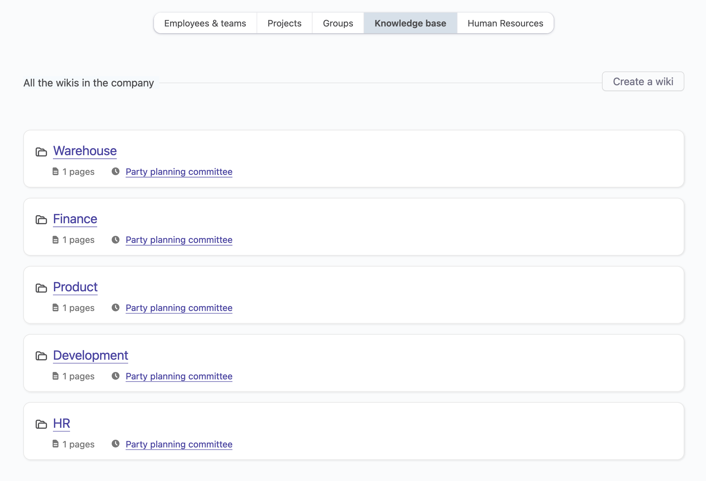
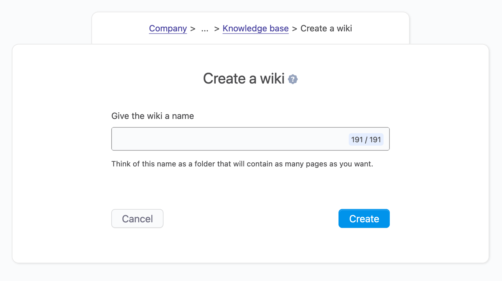
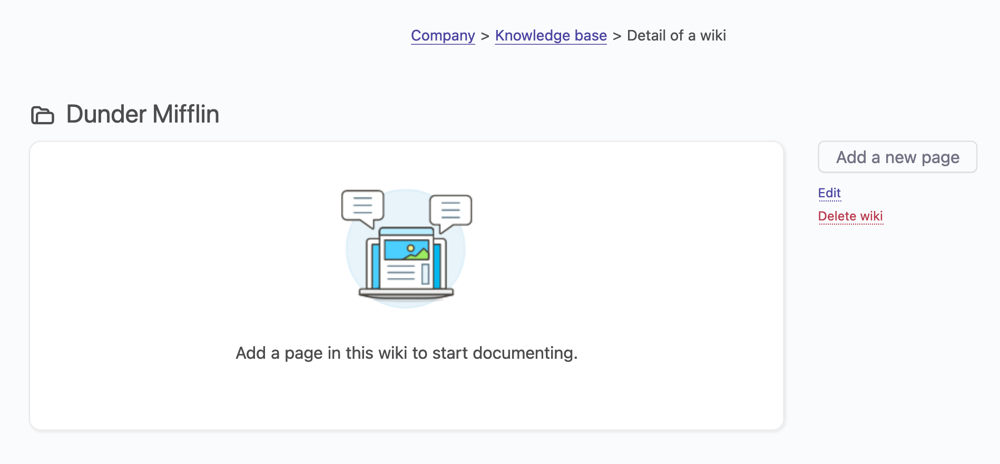
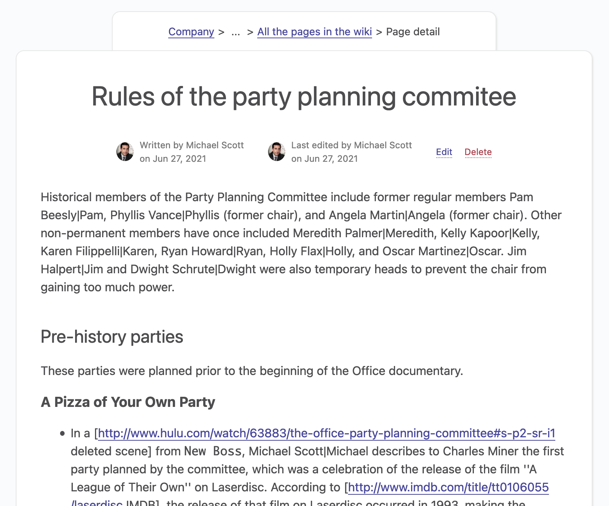

# Wikis

## Overview

Wikis let employees store information in a central place and share knowledge to all the company. Wikis, by nature, are public.

## Anatomy of a wiki

A company can have as many wiki as they want. It’s not exactly like Wikipedia, where you have one wiki and many categories and sub categories.

In OfficeLife, each wiki can be considered as a folder, like `Architecture` or `Internal processes` or `Accounting`.

Then, each wiki can have one or more pages. A page is simply an item in this wiki.

Wikis are located inside the Company tab, and this is how they look like.

Wikis are public in the company. Anyone can read, create, edit or delete a wiki, or pages inside a wiki.

::: tip Rules
* You can have as many wikis as you want in a company.
* You can have as many pages inside a wiki.
* Anyone, regardless of their permissions, can read/create/edit/delete wikis and pages.
:::

## Creating a wiki

To create a wiki, go to the Company > Knowledge base tab, and give the wiki a name.

By default, a wiki is blank and has no pages, as shown below.

::: tip Rules
* Anyone can create a wiki.
* A wiki only needs a title to be created.
* The title has a max length of 191 characters.
:::

## Pages

### Anatomy of a page

A page in a wiki has a title and a content. The content supports Markdown to format its presentation.

Every time the content of the page changes, internally, OfficeLife creates a revision of this page. Currently, we don’t display all the revisions for a page - but we do display the initial author of the page, and the last author.

### Creating a page

Wikis are made of pages. A page has two parts:

* a title,
* the content.

:::tip Rules
* Anyone can create a page.
* The title has a max length of 191 characters.
* The content supports Markdown and has a max length of 65 535 characters.
:::
