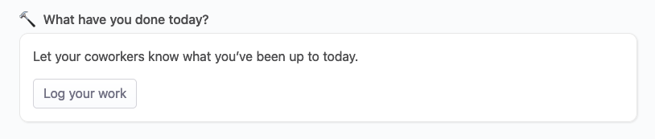

# Worklogs

## Overview

As employees we all do work every day. Work is meaningless if it's not shared throughout the team the employee works in, and the company in general, because everyone needs to know what every other person is up to, every day. Communication is key, and sharing what we will either do, or did, is extremely important.

OfficeLife provides a simple way of helping in this regard.

Every day, OfficeLife lets employees record what they will do, or what they've done. It's called worklogs.

## Anatomy of a worklog

On the dashboard, employees are being asked to describe their work.

::: tip Rules
* Adding a worklog can be done once per day.
* Worklogs are reset every day.
* The text supports Markdown and is to 65555 characters.
* Once written, worklogs can not be modified by anyone, not even the employee.
:::
