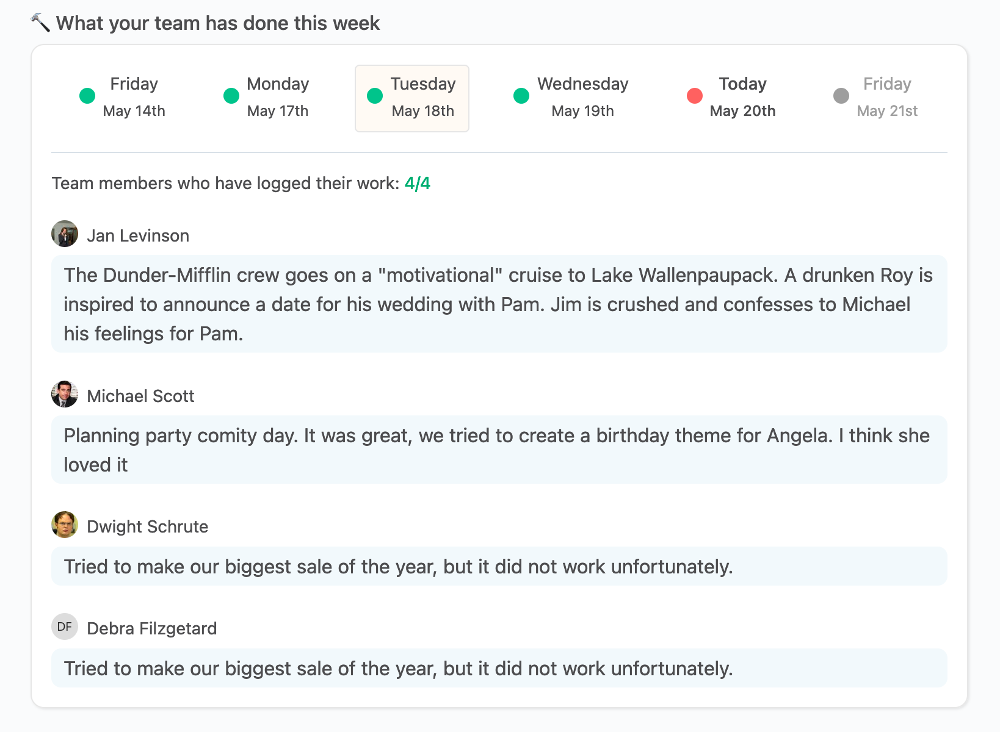
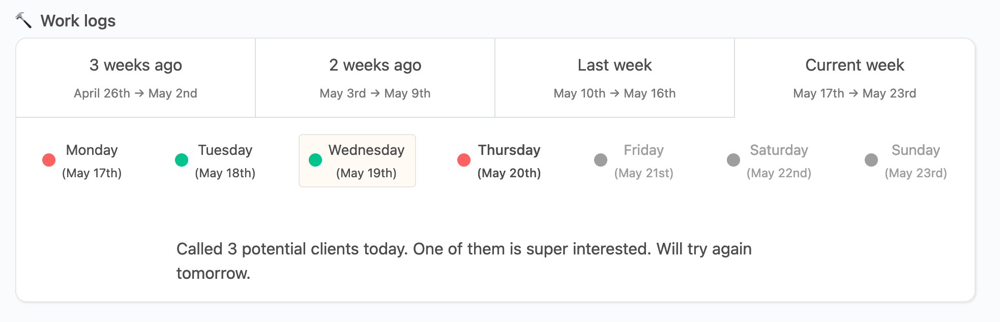

# Work logs

## Overview

As employees, we all do work every day. Work is meaningless if it's not shared with the team the employee works with, and the company in general, because everyone needs to know what every other person is up to, every day. Communication is key, and sharing what we will either do, or did during the day, is extremely important.

OfficeLife provides a simple way of helping in this regard.

Every day, OfficeLife lets employees record what they will do, or what they've done. We call this feature `work logs`.

## Anatomy of a work log

On the dashboard, every day, employees are being asked to describe their work.

::: tip Rules
* Adding a work log can be done once per day.
* Work logs are reset every day.
* The text supports Markdown and is to 65555 characters.
* Once written, work logs can not be modified by anyone, not even the employee.
:::

## Reading work logs

Once logged, work logs are available for everyone to see on different places. Remember, the goal is to share to everyone what's going on.

### On the team's dashboard

When the employee is part of a team, he has access to a tab on his/her dashboard. Inside, there is a summary of every work log of every team member for everyone to see, per day. The summary of work logs lists the 5 working days of the current week, and the entries for Friday of the previous week.

Next of each day is a visual indicator of how many employees have written a work log for the day.

* If it's red, that means no employees have written for the given day.
* Yellow means only some team members have written something.
* Green means that 100% of the team members have written a work log.

When you click on a day, you can view the details of the work logs for this day.

### On the employee's profile page

When we view the profile page of an employee, under the Work tab, we can view the history of work logs that the employee has written in the past.

We believe that knowing what we've done 2 years ago doesn't have real value. It might be fun to read, but what would be the purpose? We might revisit this decision in the future, but for now, OfficeLife will display the work logs from now up to three weeks ago.

Remember: this information is available to everyone in the company, regardless of their roles.

## Deleting a work log

Work logs can be deleted on certain conditions.

Only the following people can delete a work log:

* the employee herself,
* her manager,
* someone with the HR or admin role.
