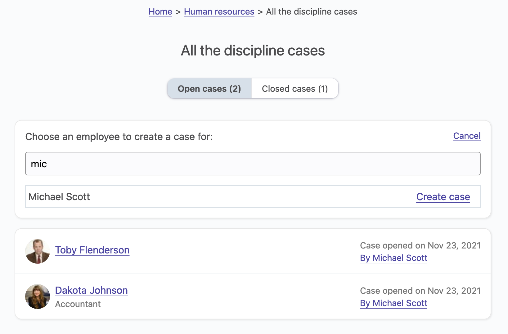
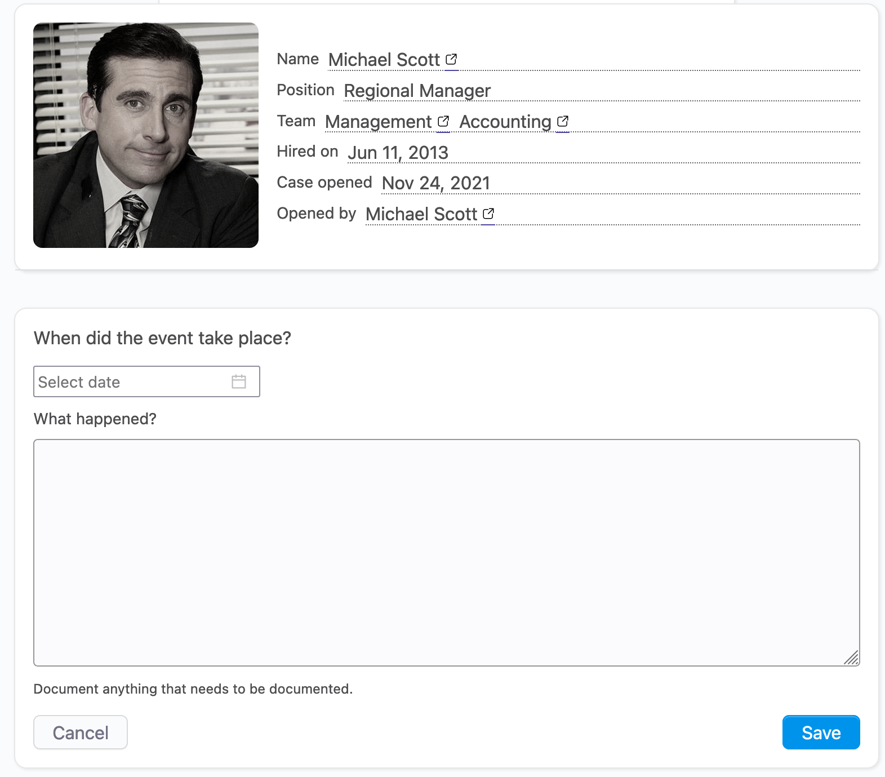

# Discipline

## Overview

Sometimes, unfortunately, you have to take actions against an employee who causes problems, whatever they are. In the unfortunate event that your efforts do not result in the desired improvements and you decide to let go your employee, you will want to have comprehensive documentation of all the steps you took to help your employee improve.

OfficeLife is designed to help you do this.

When a problem occurs, the manager and/or a HR representative can open a case to start documenting what happened and what the employee should do to improve the situation.

The case is completely private and is only visible to the manager and HR representatives. If the employee has a new manager, the case will only be visible to the new manager, and the old manager will not be able to see the case anymore.

A case can have two statuses: open and closed. An active case means that disciplinary measures are being taken. A closed case means that the employee does not need help anymore. When an employee once had a case, it will remain in his/her file forever.

A case has a number of events. An event is something that happened - a bad behaviour, a bad performance,… An event has a date, a description and optionally an attached file.

HR representatives can:
* see all the opened or closed cases,
* search a case by the employee's name,
* delete a case.

Managers can:
* see all the opened cases for employees they manage,
* add events.

## Creating a case

Only a HR representative can create a discipline case.

The case should be opened on the HR tab on the dashboard.

To create a case, you need to first indicate which employee is concerned about this case, as shown below.

### Adding events to the case

Once the case is created, you might want to document what happened with the employee as events occur. To do so, click on the Add event button, and start documenting.

