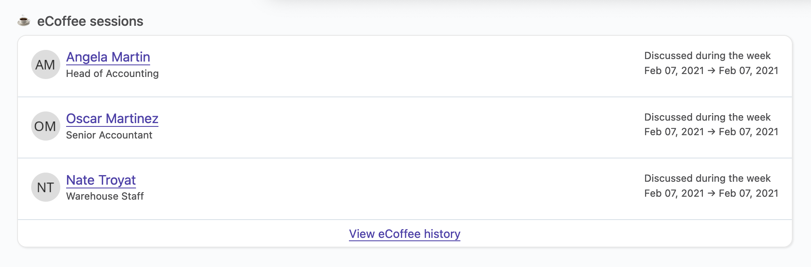
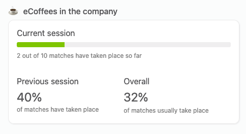

# e-Coffee

## Overview

In remote companies, it’s really hard to get to know people considering how it’s really easy to focus only on work during your daily interactions with your colleagues. In a non-remote world, random interactions happen and this is when you get to know people. A chat over coffee, or when the printer is taking its time to print the way too big batch of sheets that your colleague printed, etc... This is how you bond with people, and how you eventually produce better work.

Also, when new employees are hired, they simply have no clue about their colleagues.

To help with this, OfficeLife comes with a nice feature called e-Coffee. Once enabled in your company, it will randomly match employees together, every week, so they can take 15 minutes to talk about everything but work.

## Setting up e-coffee in your company

To set up the e-coffee process in the company, head over to `Adminland` > `Manage eCoffee process`.

In this screen, you have access to a simple setting that lets you activate the eCoffee process.

Once enabled, the eCoffee process will start the next Monday.

At Monday on midnight (UTC), OfficeLife will take all the employees in the company and, for each employee, will randomly match him/her with one colleague.

If the number of employees is even, one of the employees in the company will be matched twice to make sure everyone is matched with a colleague.

There is nothing else to do to activate the e-coffee process in your company.

## Participating to an e-Coffee session

When the e-coffee process is activated in the company, each Monday, employees will see on their dashboard the employee they've been matched with.

It’s up to employees to actually setup the time to talk to each other. OfficeLife simply tells them who they should talk to.

::: tip Rules
* As all the other information that are displayed on the Employee dashboard, the information is private to the employee who is logged.
* No one, even employees with HD or the Administrator privilege, can mark an e-coffee session as participated.
:::

Once the e-coffee took place, employees can use the `I've participated` button. This will dismiss the box from your dashboard.

## Viewing past e-coffee sessions as an employee

Employees can see the list of e-coffee sessions along with the people they were matched with on their Employee profile page.

The default view shows up to 3 latest e-coffee sessions.

You can see the full list of matches for this employee by clicking on the `View eCoffee history`.

## Accessing more information about current and past e-coffee sessions as HR

Human resources representatives have more information of the current e-coffee session, and past sessions.

Inside the HR tab of the Company screen, employees with the HR status can see a dashboard showing:

* the number of matches who have been taken place so far for the current e-coffee session,
* the number of amtches who have been taken place in the previous e-coffee session,
* and finally, how many matches usually take place in a session.

