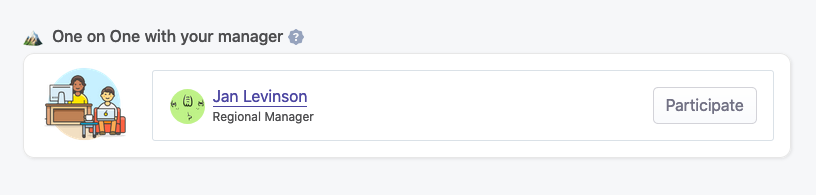
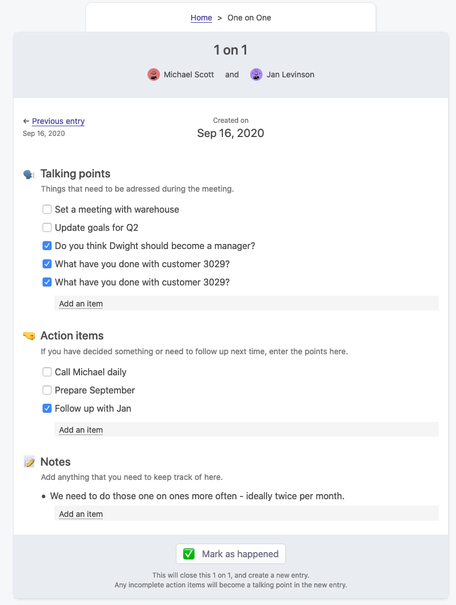
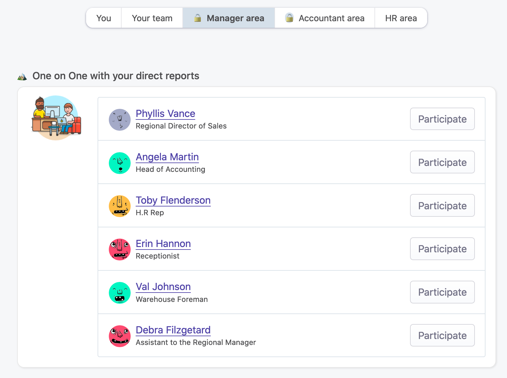

# One-on-ones

## Overview

One-on-ones are vital processes in every company. Managers need to spend some time with their employees to let them share ideas and concerns. That's also a great way to strengthen the relationships between them. Most importantly, it ensures that employees feel like they are working towards their goals.

OfficeLife provides a convenient way to do one-on-ones.

At its core, one on one is a process between the employee and his/her manager. In real life, they both have some kind of agenda that is discussed every time the two meet. OfficeLife is no different. It will give you an entry for each occurrence of the one on one process, and both participants can participe in creating the agenda or changing things the way they want.

OfficeLife won’t manage the recurrence of this meeting. It’s up to the manager or the direct report to create a new entry of this meeting, every time it needs to happen.

## Creating a one-on-one

The feature of One-on-ones exists automatically if an employee is assigned to a manager. It will appear on

* the dashboard of the direct report,
* the Manager tab on the dashboard of the manager.

A one-on-one entry is composed of:

* talking points,
* action items,
* optional notes.

Each talking point and action item can be checked to make sure the point has been covered during the discussion. However, if there are action items that are not checked during the meeting, they will be carried over the next entry (as talking points) so it’s not forgotten. That lets you make follow ups and make sure nothing falls into the cracks.

## Creating another one-on-one

Every one-on-one meeting needs its own agenda. This is why on every entry, there is a button that says `Mark as happened`.

This button marks the current entry as completed, and creates a new entry.

Once an entry is completed, its content can’t be changed, ever.

## Editing a one-on-one

One-on-ones can be modified by either the manager or the direct report, as long they have not been marked as completed. In this case, the entries can’t be modified and are in a read-only mode.

## Viewing past entries

All previous entries (and of course, the current entry) can be consulted by either the manager or the direct report on the dashboard, as well as on the profile of both employees.

### Employee’s profile page

On the employee's profile page, the 3 latest entries that the direct report had with his manager appear, as seen below.

When we click on one of these entries, you can see the details of the one on ones.

You also have access to a page listing all the one on ones that ever happened between the employee and his manager, or previous managers – even if the employee currently doesn't have any managers. This page indicates two useful statistics:

* how many occurences of one on ones the employee has had in the last 365 days,
* how many days on average are there between one on ones sessions.

This transparency might be very useful for both the employee and his manager, so they both know if they should meet more often.

No one, except the employee, the manager or someone with either the HR or administrator role, can view those one on ones.

### On the dashboard for managers

When you are a manager, you need to have a quick way to see all one on ones with all your direct reports.

This is why all the one on ones are located inside the Manager tab on the dashboard, as seen below.

