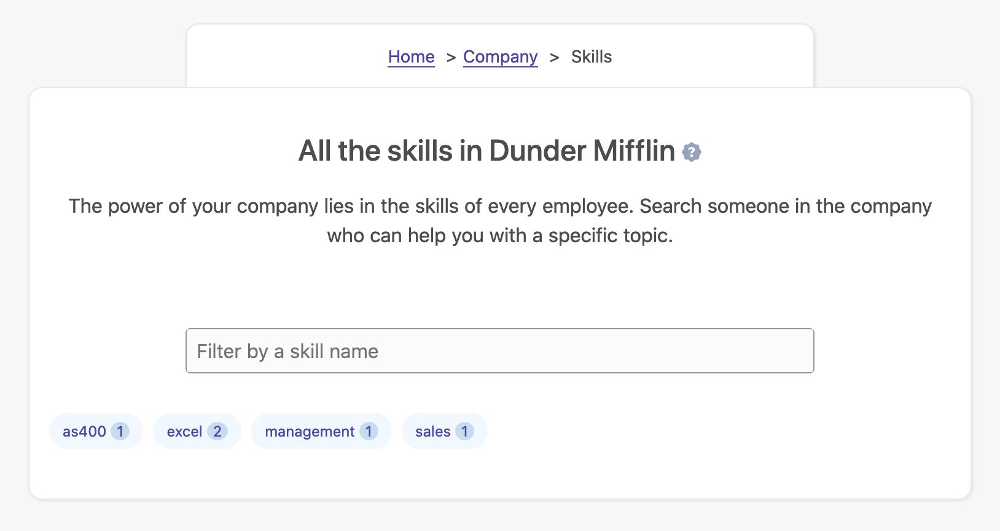
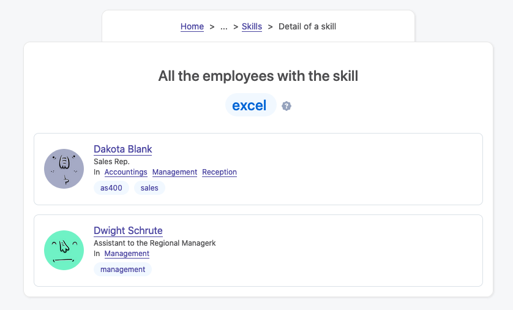
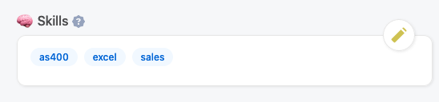
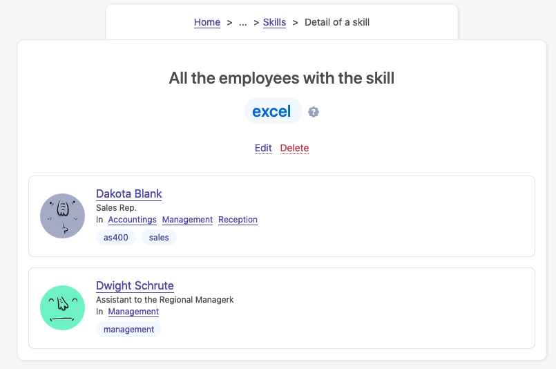

# Skills

## Overview

Sometimes in your job, you have questions about very specific subjects. You know that someone in the company has answers to these questions, but you have no idea who. Each employee has a specific set of skills, or knowledge. It can be about `PHP`, or `how Siemens machine work`, or `kitchen pricing strategies`. So you end up asking around and hope that someone knows somebody who can help you.

Skills in OfficeLife are here to solve this problem. Employees can enter their own skills, and everyone in the company can search a specific skill to find all the people who match the skill. It’s simple, and efficient.

## Browsing skills

You can browse skills in several ways:

* from the employee’s profile: you can click on a skill to browse all employees who have this skill,
* you can finally go on the Company tab and access the list of skills there.

### On the company page

All the skills used in the company are listed on the Company tab. On this screen, skills are listed alphabetically and each one displays the number of employees associated with it.

Clicking on a skill leads to the details of this skill, showing all the employees who are associated with it.

### On the employee’s profile page

The skills of an employee are listed on his employee’s page.

## Creating a skill

Creating a skill is easy and happens on your employee’s profile page. Only employees can create a skill, and each employee is responsible for entering his own set of skills. To create a skill, you have to type the skill name, which will either find it from the list of existing skills entered by other employees, or let you create a new skill.

A skill that you create, can also be chosen by another employee on his own profile.

Once created, the skill will be displayed on your profile page.

For the Latin alphabet, accents will be automatically removed from the skill name (accents like `é`, `õ`), and words will be saved as lowercase. For example, `Météo` will be saved as `meteo`. Why? Simply because as skills can be created by anyone in the company, it could be very easy to have the same word with a different case, or for non-English words, to create two words from the same word, but with different accents. By removing accents and putting words in lowercase, we increase the chance that people will find the skills they are looking for.

::: tip Rules
* A skill can only be created by the employee.
* someone with either the HR or administrator role can also add a skill to an employee employee’s profile to delete a skill.
* The name of the skill is mandatory and limited to 255 characters.
* Accents (for the Latin alphabet) will be automatically removed from the name.
* Upon saving the skill, it will be converted to lowercase automatically.
:::

## Updating a skill

On your employee’s profile page, you can’t update a skill. In order for you to update a skill, you simply need to remove it from the list of your skills and create a new one.

That being said, an administrator can update the name of a skill from the list of skills in the Company tab. When changing this name, it will be reflected everywhere.

::: tip Rules
* Only someone with the HR or administrator role can edit a skill.
* Accents (for the Latin alphabet) will be automatically removed from the name.
* Upon saving the skill, it will be converted to lowercase automatically.
:::

## Deleting a skill

You can remove skills from your profile anytime. To remove a skill, you need to toggle the Edition of the skills by pressing the button on your profile, and select the skill you want to remove. Changes will be instant.

If you were the only one employee with this skill in the company, and if you remove it from your profile, the skill itself will be permanently deleted from the system and won’t be searchable anymore – at least unless someone re-creates it.

There is an exception though: an administrator can delete the skill from the list of skills. Doing that will remove the skill for all employees.

::: tip Rules
* The employee can remove his own skills from appearing on his profile.
* Someone with either the HR or administrator role can also edit an employee’s profile to delete a skill.
* Someone with either the HR or administrator role can delete a skill entirely from the list of skills in the Company tab.
:::
