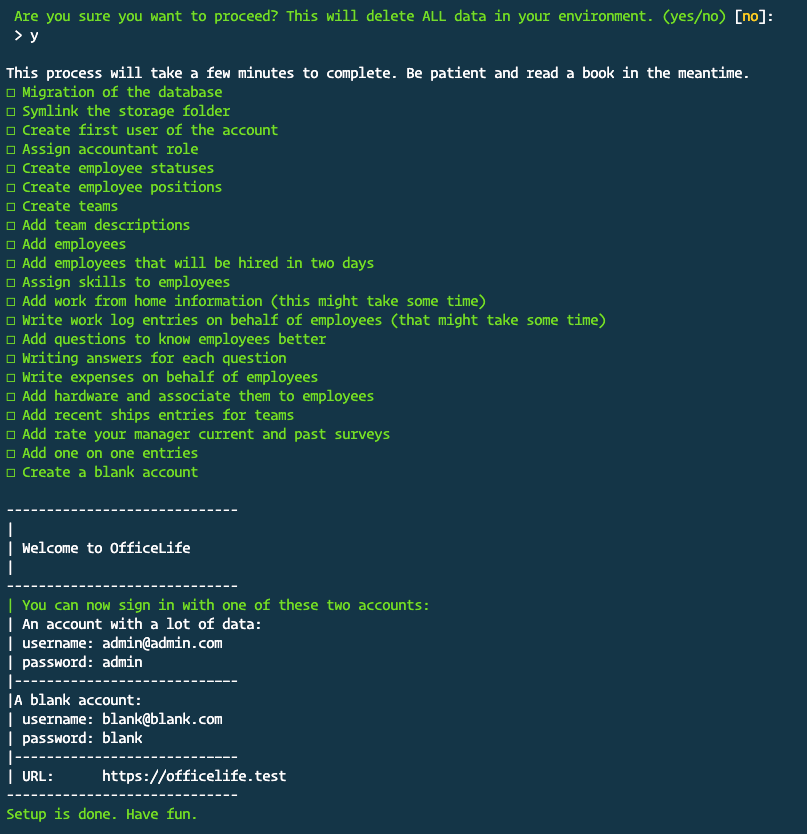

# Installation

## Which version of OfficeLife should you use

OfficeLife comes in two flavors:

* as a SAAS, meaning that you need to pay a monthly fee to access the service, on an instance that we host ourselves. We take care of everything, from maintenance to upgrading the instance,

* as a software that you can download and install yourself. You will have to maintain this instance yourself. However it’s free, so `¯\_(ツ)_/¯`

Below are all the steps you need to follow to install an instance of OfficeLife yourself.

## Requirements for self-hosting

::: warning
This page requires a deep technical knowledge to understand it. If you are unsure on how to install OfficeLife, either ask a developer on your team, or [sign up on for an account](https://officelife.io) on an instance that we, the OfficeLife team, offer.
:::

OfficeLife is a Laravel-based application and requires the following technologies to run efficiently.

* PHP 8 or higher,
* a set of extensions:
  * BCMath PHP Extension
  * Ctype PHP Extension
  * Fileinfo PHP Extension
  * JSON PHP Extension
  * Mbstring PHP Extension
  * OpenSSL PHP Extension
  * PDO PHP Extension
  * Tokenizer PHP Extension
  * XML PHP Extension
* MySQL, Mariadb or PostgreSQL
* Apache or Nginx

### Deployment

- We recommend [Fortrabbit](https://www.fortrabbit.com/) and [Platform.sh](https://platform.sh/) as PaaS (Platform As A Service) hosts, or [Forge](https://forge.laravel.com) and [Ploi](https://ploi.io/) as IaaS platforms provisioner, to deploy an OfficeLife instance.

- You can also use our official [Docker image](https://github.com/officelifehq/docker/pkgs/container/officelife-dev) if you prefer.

- You can also download a bundle asset from our [releases](https://github.com/officelifehq/officelife/releases) containing all dependencies at once. The assets also contains gnupg signature files, signed off with the key `0x213F85B7B1B8F93224FA85B138C2BAD715449E85`. You will find the public key on several [keyservers](https://keyserver.ubuntu.com/pks/lookup?search=0x213F85B7B1B8F93224FA85B138C2BAD715449E85&fingerprint=on&op=index), or [here](pubkey.asc).

### Setup

You should configure your web server's document / web root to be the `public` directory. The `index.php` in this directory serves as the front controller for all HTTP requests entering your application.

Once installed, run this command to setup everything:
```
php artisan setup
```

### Directory permissions

You may need to configure some permissions. Directories within the `storage` and the `bootstrap/cache` directories should be writable by your web server or OfficeLife will not run.


## Configuration

All configuration are set through the `.env` file or within environment variables.
The `.env.example` file contains a list of common configuration you might want to use. These are the main ones:


### Global config

- `APP_ENV`: set to `production` for a production installation
- `APP_KEY`: this is provisionned by the `php artisan key:generate` command, or you can manually generate it using this command: `echo -n 'base64:'; openssl rand -base64 32`
- `APP_DEBUG`: this should be set to `false` for a production installation. If set to `true`, this will display all debug traces when an error occurs, so you should never, ever set it to `true` for production use.
- `APP_URL`: url of the application, used to format the email dispatch

### Database config
- `DB_CONNECTION`: use `mysql` (mysql or mariadb) or `pgsql` (postgreSQL)
- `DB_HOST`: ip address of the database host, or the container name in a docker environment
- `DB_PORT`: database port
- `DB_DATABASE`: database name
- `DB_USERNAME`: database username
- `DB_PASSWORD`: database password

### Logs and cache

- `LOG_CHANNEL`: See [`logging.php`](https://github.com/officelifehq/officelife/blob/main/config/logging.php) for session.php log channels. For docker container, use `errorlog`. On Heroku or fortrabbit, use `syslog`.
- `SESSION_DRIVER`: set to `database` for general usage. See [`session.php`](https://github.com/officelifehq/officelife/blob/main/config/session.php) for available session drivers.
   - For `redis` see section below.
- `CACHE_DRIVER`: A cache system is a good way to speed up your application. Set it to `database` for general usage. You can also use `redis`, `memcached`, or `dynamodb`. See [`cache.php`](https://github.com/officelifehq/officelife/blob/main/config/cache.php) for available drivers.
   - For `redis` see section below.

### Queue connection
See [Cron and queue](#Cron-and-queue) section.

- `QUEUE_CONNECTION`: Setting a queue worker is good way to speed up your application. Set it to `database` for general usage. Or you can use `redis`, `beanstalkd`, or `sqs`. See [`queue.php`](https://github.com/officelifehq/officelife/blob/main/config/queue.php) for available drivers. Be aware that you will need to setup a worker for the queue to function.
   - For `redis` see section below.

### Redis
If you use redis for cache or session, you'll have to set these variable too:
- `REDIS_HOST`: ip address of the redis instance, or docker container name
- `REDIS_PASSWORD` and `REDIS_PORT`

### Mailing
Define your mailing system to use:

- `MAIL_MAILER`: the mailer config to use: `smtp`, `sendmail`, `mailgun`, `ses`, or `postmark`
- Set these variable according to your configuration:
`MAIL_HOST`,
`MAIL_PORT`,
`MAIL_USERNAME`,
`MAIL_PASSWORD`,
`MAIL_ENCRYPTION`
- `MAIL_FROM_ADDRESS` and `MAIL_FROM_NAME` for outbound mail information

### Services

- `LOCATION_IQ_API_KEY`: API key for [LocationIQ](https://locationiq.com/) geolocation service. LocationIQ offers 10,000 free requests per day.
- `MAPBOX_API_KEY` and `MAPBOX_USERNAME`: API key for maps displays using [Mapbox](https://mapbox.com/).
- `CURRENCY_LAYER_API_KEY` and `CURRENCY_LAYER_PLAN` (`free` or `premium`): API key for getting currency exchange rates, using [CurrencyLayer](https://currencylayer.com/).
- `UPLOADCARE_PUBLIC_KEY` and `UPLOADCARE_PRIVATE_KEY`: API key for uploading files in [Uploadcare](https://uploadcare.com).

### External login services

You can add external login services to OfficeLife.

- `LOGIN_PROVDERS`: a coma-separated list of enabled login providers. Available providers are: `azure`, `github`, `google`, `linkedin`, `monica`, `saml2`, `slack`, `twitter`.


#### Azure Active Directory

Create an new App registration, using the `Web` redirect URI. The callback url is: `https://yourapp.com/auth/azure/callback`.

- `AZURE_CLIENT_ID`: the Application (client) ID
- `AZURE_CLIENT_SECRET`: a new client secret value you have generated

#### GitHub

Go to you Developer settings and create a new OAuth App. The Authorization callback URL is: `https://yourapp.com/auth/github/callback`.

- `GITHUB_CLIENT_ID`: the client ID
- `GITHUB_CLIENT_SECRET`: a new client secret value you have generated

#### Google

Go to the Google Cloud console, and setup a new project. Create a new OAuth 2.0 client ID, using `https://yourapp.com/auth/google/callback` as autorized redirect URI.

- `GOOGLE_CLIENT_ID`: the OAuth 2.0 client ID
- `GOOGLE_CLIENT_SECRET`: the OAuth 2.0 client secret

#### Monica

On the API settings, create a new OAuth client, using `https://yourapp.com/auth/monica/callback` as Redirect URL.

- `MONICA_HOST`: url of your monica host
- `MONICA_CLIENT_ID`: the client ID
- `MONICA_CLIENT_SECRET`: the client Secret

#### LinkedIn

On LinkedIn developers portal, create a new app. In Auth setting, setup OAuth 2.0 settings using `https://yourapp.com/auth/linkedin/callback` as Authorized redicret URL.

- `LINKEDIN_CLIENT_ID`: the client ID
- `LINKEDIN_CLIENT_SECRET`: the client Secret

#### Saml2

Saml2 is a generic provider standard. The callback UI will be `https://yourapp.com/auth/saml2/callback`.
You can add a name to your Saml2 application by setting `SAML2_NAME`.

Once you have setup you saml2 application, you can either
- Set the `SAML2_METADATA` to the metadata url
- Or set `SAML2_ACS`, `SAML2_ENTITY_ID`, `SAML2_CERTIFICATE` with the right values

#### Slack

On slack API, create a new app, and setup OAuth & Permissions, using `https://yourapp.com/auth/slack/callback` as Redirect URLS, and adding `identity` User Token Scopes.

- `SLACK_CLIENT_ID`: the client ID
- `SLACK_CLIENT_SECRET`: the client Secret

#### Twitter

On twitter developer portal, create a new app or project. Activate the 3-legged OAuth authentication, and set `https://yourapp.com/auth/twitter/callback` as Callback url.

`TWITTER_CLIENT_ID`
`TWITTER_CLIENT_SECRET`


## Cron and queue

OfficeLife is a Laravel-based application, and requires a cron to run, and possibly a queue worker if you can.

### Cron
The cron is a job that run at regular intervals, ideally every minutes.
Setup a cron that run this command:
```
php artisan schedule:run
```
See [Laravel documentation](https://laravel.com/docs/8.x/scheduling#running-the-scheduler)

### Queue

Setting up a queue is a very good way to improve performances on OfficeLife.

There are 2 steps to follow:
- Setup a [queue worker](https://laravel.com/docs/8.x/queues#running-the-queue-worker), using a specific docker container, or tools like supervisor. The command to run is:
    ```
    php artisan queue:work --sleep=1 --timeout=0 --tries=3 --queue=default,low
    ```

- Defines `QUEUE_CONNECTION` variable to use a non-sync queue. See [Queue connection](#Queue-connection) section.


## Setup OfficeLife for development purposes

If you want to install OfficeLife locally to support the development, you can follow the instructions on [the developer page](/contribution/core-contributors/installation.md).

## Installation on Heroku

Officelife can be deployed on Heroku using the button below:

[](https://heroku.com/deploy?template=https://github.com/officelifehq/officelife/tree/main)

Before deployment, Heroku will ask you to enter a custom `APP_KEY` when asked (for instance you can use this command to generate the key: `echo -n 'base64:'; openssl rand -base64 32`).

After deployment, click on the `Manage app` button to open the dashboard of your new application, as shown below.


Click on `Heroku Scheduler` to open the scheduler dashboard. Create a new job, and define a new job to run this command every 10 minutes or every hour at 00 minutes:

```sh
php artisan schedule:run
```

You are now able to open the application and register a new user.


## Populate account with fake data

We provide a way to try out OfficeLife with semi-real data that will give you a good sense of what the tool’s capabilities are. Having an account with a lot of employees and a lot of activities should give you enough of an idea.

We provide a custom command that needs to be executed in the terminal to achieve this.

``` bash
php artisan setup:dummyaccount
```

::: warning
Running this command will wipe your database entirely in order to set up a new set of data. Make sure you backup any existing data before running this command.
:::

When you run the command, here is what you should expect to see:



Depending on your database and hardware, it can take up to 5 minutes for the script to run.

Once the script has run, two accounts will be created:

* One of the account will be Michael Scott, administrator of the account and you should be able to sign in to your account by using `admin@admin.com` as your email address, and `admin` as the password. It will contain a lot of data. We are a big fan of the TV show The Office, and as a joke, the fake account mimics what would happen in the fictive company Dunder Mifflin.
* The second account will be an empty account, so you can see the blank state. You need to sign in with `blank@blank.com` and the password `blank`.
