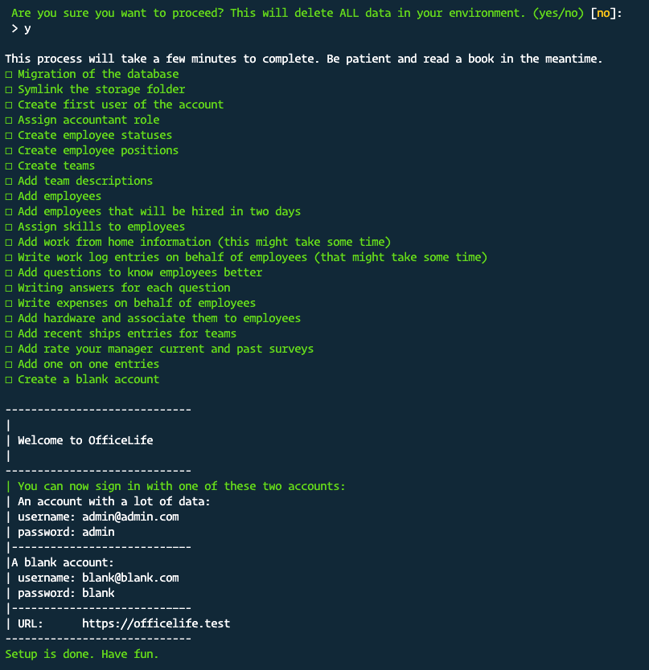

# Installation

::: warning
This page requires a deep technical knowledge to understand it. If you are unsure on how to install OfficeLife, either ask a developer on your team, or [sign up on for an account](https://officelife.io) on an instance that we, the OfficeLife team, offer.
:::

## Requirements for self-hosting

OfficeLife is a Laravel-based application and requires the following technologies to run efficiently.

* PHP 7.4 or higher,
* a set of extensions:
  * PHP >= 7.3
  * BCMath PHP Extension
  * Ctype PHP Extension
  * Fileinfo PHP Extension
  * JSON PHP Extension
  * Mbstring PHP Extension
  * OpenSSL PHP Extension
  * PDO PHP Extension
  * Tokenizer PHP Extension
  * XML PHP Extension
* MySQL or SQLite,
* Nginx.

We recommend [Forge](https://forge.laravel.com) or [Ploi](https://ploi.io/) to provision the servers needed to run OfficeLife. You can also use our official Docker image if you prefer.

## Configuration

You should configure your web server's document / web root to be the `public` directory. The `index.php` in this directory serves as the front controller for all HTTP requests entering your application.

## Directory permissions

You may need to configure some permissions. Directories within the `storage` and the `bootstrap/cache` directories should be writable by your web server or OfficeLife will not run.

## Populate account with fake data

We provide a way to try out OfficeLife with semi-real data that will give you a good sense of what the tool’s capabilities are. Having an account with a lot of employees and a lot of activities should give you enough of an idea.

We provide a custom command that needs to be executed in the terminal to achieve this.

``` bash
php artisan setup:dummyaccount
```

::: warning
Running this command will wipe your database entirely in order to set up a new set of data. Make sure you backup any existing data before running this command.
:::

When you run the command, here is what you should expect to see:



Depending on your database and hardware, it can take up to 5 minutes for the script to run.

Once the script has run, two accounts will be created:

* One of the account will be Michael Scott, administrator of the account and you should be able to sign in to your account by using `admin@admin.com` as your email address, and `admin` as the password. It will contain a lot of data. We are a big fan of the TV show The Office, and as a joke, the fake account mimics what would happen in the fictive company Dunder Mifflin.
* The second account will be an empty account, so you can see the blank state. You need to sign in with `blank@blank.com` and the password `blank`.