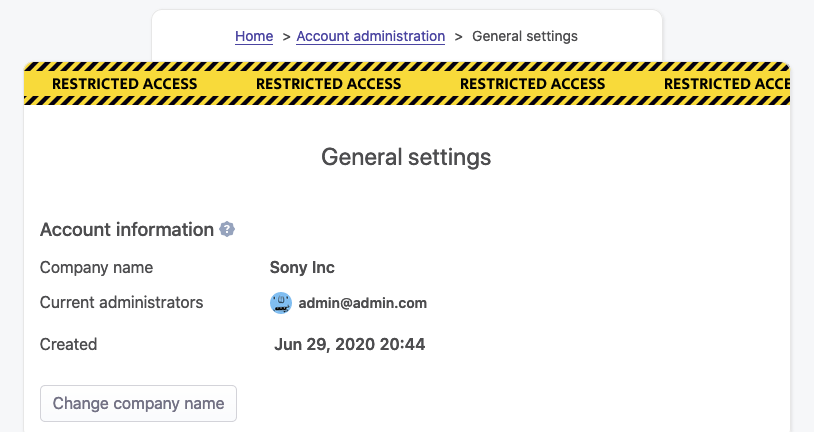
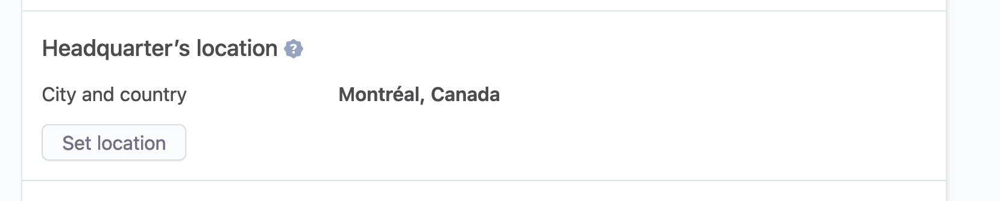
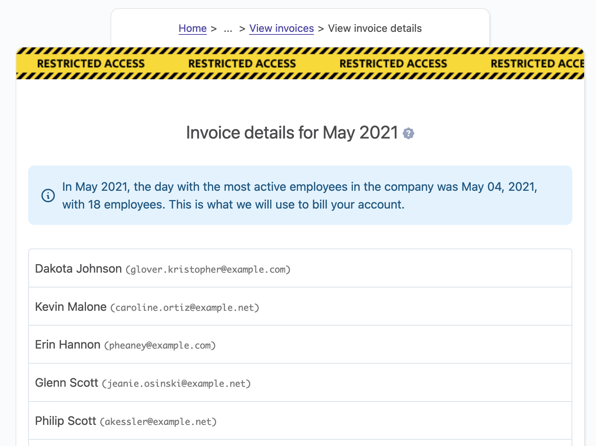

# Management of the company

## Company information

### Overview

Every company has some specific details: name, currency used, timezone.

OfficeLife lets you customize some aspects of your company, without giving too many settings to play with. We believe that settings should be avoided as much as possible. But some things should be configurable.

### Update company’s name

Your company’s name is saved when you first create your company’s account. However, you can always change it as much as you want – although we suspect you won’t have to change the name that often.

That being said, updating the name is really easy. Click on the Rename button and choose a new name. The name will be instantly changed everywhere in the software and all documents that you can export.

::: tip Rules
* Only someone with the administrator role can update the company name.
* The name of the company should be no longer than 255 characters.
:::

### Code to invite employees

There are several ways for employees to be invited to your account:

- [Add an employee manually](/documentation/manage/employee-management.html#add-a-new-employee),
- [Import employees](/documentation/manage/employee-management.html#importing-employees),

But there is another way! It’s possible to give a code to your employees, and your employees can use this code themselves so they can join your company once they’ve created an account.

It’s simple and convenient.

The code is unique per company, and hard enough to guess so your privacy is protected. We might add additional checks in the future to prevent abusing this system.

## Currency

### Overview

Every company needs to deal with money at some point. Money is represented by a currency. In OfficeLife, at the moment, a company can only have one active currency.

Currencies in OfficeLife strictly follow the [ISO 4217](https://en.wikipedia.org/wiki/ISO_4217) specification, meaning that they are defined by a three letters code. Thus, Euro is `EUR`, US dollars is `USD` and so on.

Current features that use the concept of company currency:

* Expenses.

### Defining the company’s currency

By default, when you create your OfficeLife account, your account is assigned a default currency automatically: USD, or US dollars. You can change this in Adminland.

Go to Adminland section, under general, and indicate which currency is the default in your company.

::: tip Rules
* Only someone with the administrator role can change the currency used in the company.
:::

## Logo

A company can express its identity through its visual identity. When the company logo is set, it will appear on the Company's dashboard under the Company tab.

To upload or change the logo of the company, go to Adminland > General, and simply click on the Logo at the bottom of the page.

::: tip Rules
* Only someone with the administrator role can change the logo.
* The logo will be seen by anyone in the company.
:::

## Defining the company’s founded date

The company's date of creation is displayed on the Company tab in your account. It’s a nice detail so everyone knows how resilient the company is (or young, in that case). You can change this date in Adminland.

Go to Adminland section, under general, and indicate when the company has been created.

::: tip Rules
* Only someone with the administrator role can change this date.
* You only have to indicate the year the company has been founded.
:::

## Defining the company’s main location

The main location of the company is displayed on the Jobs public page, accessible from Internet, from anyone to see. The location is a free text field, and we advise to put the city and the country in this field.

To indicate the company's location, go to Adminland section, under General, and search for the Company location section.

::: tip Rules
* Only someone with the administrator role can change the location.
* The location field is limited to 191 characters.
:::

## Account billing

OfficeLife’s business model is based on the number of active employees in your account for any given month.

Every night at midnight, OfficeLife will check the number of active employees in your account (ie the number of employees who are not locked). It will store this number in your account, along with the name and email address of each active employee.

At the end of each month, OfficeLife will check the highest number of active employees in your account that happened during the month, and will consider this value to be the basis of your billing.

In Adminland, you can find what happened during each month and see why we decided to bill you this amount based on the number of active employees. Below is an example of the invoice section.

Then, if you click on a given month, you will find the details of the billing.

## Account cancellation

You are in complete control of your data. You can cancel the company’s account at anytime.

Keep in mind, though, that cancelling the company’s account means

* all the data will be immediately deleted from the servers. Immediately.
* data is kept in the backups for 60 days. After 60 days, the backups will be deleted. We won’t be able to restore your data from the backup, though.

::: tip Rules
* Only someone with the administrator role can cancel the company’s account.
:::
