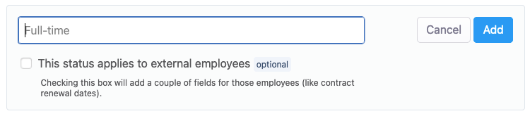
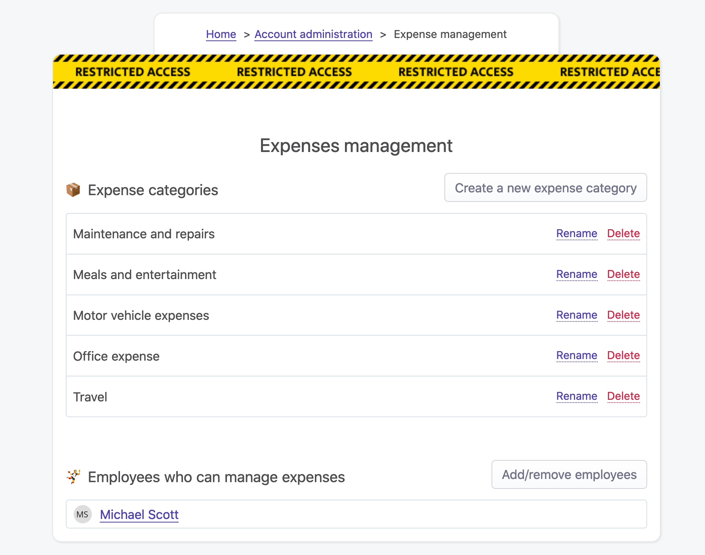

## Overview

An Employee is one of the core concepts of OfficeLife. It represents a human who works at a company.

In OfficeLife, an employee is not necessarily linked to a user. It’s really important to understand this. A user can have two different accounts in two different companies, with the same user account. This is because when a user creates an account in OfficeLife, he can actually join an existing company or create a new one.

A user is someone who has access to OfficeLife, and when he’s inside his account, he’s an employee. However, an employee has to be created inside OfficeLife by a user.

## Manage employees

Employees are managed in Adminland. Here are all the things you can do in Adminland about employees:

* add and invite employees,
* lock an employee’s account,
* delete an employee.

### Add a new employee

To add a new employee, you need 3 pieces of mandatory information:

* first name,
* last name,
* and email address.

During this process, you can invite the employee by email. This will send an email to this employee, inviting him to create an account on OfficeLife so he actually use the software. You don't have to invite this person by email at this stage as you can do this later on.

If an employee is invited to create a user account, he will be put in an `Invited` state. This state will simply serve as an indicator on the list of employees and will disappear as soon as the employee creates an account after being invited.

The final mandatory information is the role this employee will have. Refer to the documentation about roles to know more about what that means.

::: tip Rules
* Only employees with the HR or administrator roles can add an employee.
* The first name, last name and email address fields are limited to 255 characters.
:::

### Locking an employee

Instead of having to delete an employee, you can lock the employee’s account. Locking lets you prevent the employee from logging into his account, but keep track of everything this employee has ever done in OfficeLife.

Locking an employee should be used in those cases:

* when an employee leaves the company,
* when an employee has been let go.

Locking is not a permanent action as you can unlock an account anytime if you change your mind.

Contrary to the deletion process, locking will not erase any data we have on the employee.

::: tip Rules
* Only employees with the HR or administrator roles can lock an employee.
* An employee can't lock himself, even with enough permissions. That means an administrator can't lock himself.
* Once an employee is locked, he won’t appear in the search results anymore, nor in the list of employees in the application.
* He won’t be listed in the list of team members if he was part of a team.
* If the employee was a manager with expenses to validate, expenses will be moved to the accounting stage directly.
* If the employee had [the accountant role](/expenses/#who-can-manage-expenses), this role will automatically be removed.
* [Current polls](/rate-your-manager) about the employee (if this employee was a manager) will be stopped immediately.
* He will still appear in the list of employees inside Adminland.
* All content written by the employee will still be available for everyone to see (worklogs, answers to questions,…).
* The employee’s profile will still be accessible through direct links.
:::

### Deleting an employee

Deleting an employee is an important decision. It will immediately destroy everything OfficeLife knows about an employee, and will prevent the employee to log in to this OfficeLife account. Those changes will be effective immediately.

There are two ways to delete an employee:

* either by choosing the employee on the list of employees in Adminland,
* or by going through the employee's profile and select the Delete option in the upper right menu.

Once an employee is removed from OfficeLife, everything that is linked to this employee is also removed. That means, for instance, if the employee was a team leader, the team won’t have a team lead anymore. All answers will be removed. All worklogs will also be removed. And so on.

::: tip Rules
* Only employees with the HR or administrator roles can delete an employee.
* An employee can't delete himself, even with enough permissions (for instance, an administrator can't delete himself).
:::

## Profile page

Every Employee, linked to a User or not, has a profile page. This page is public inside the company - meaning everyone in the company can see most of the information on this page (unless those who are not shown by default). All of the data entered by an employee on most screens in OfficeLife appear on the profile page of the employee. Also, every action done on an employee appears on the Employee log.

### Employee birthdate

The birthdate is a private information. No one, except the own employee and employees with either the HR or the administrator roles, can see the complete birthdate. Viewing the complete birthdate means knowing the age of the person - and this is private.

However, in order to get to know your colleagues, it’s nice to know one’s day and month of birth. This is why when you visit the profile of someone in OfficeLife, you will see the day and month of birth of this person.

### Hiring date

The hiring date is the date that the employee joined the company (or will join the company, if this date is in the future). Adding or updating this date can only be done by someone with either the HR or administrator role, and can’t be done by the employee.

Everyone in the company can see the complete date an employee joined the company.

If this date is set in the future, that means the employee will soon join the company. When this date is in the range from now to next week, and if the employee will be part of a team, he will appear on the team’s dashboard so everyone on the team will know someone new is coming, as shown below.

### Work anniversaries

It’s interesting to know when a colleague has a work anniversary. It’s a date to celebrate. OfficeLife will warn employees when a work anniversary will occur in the upcoming week. This information is displayed on the team’s dashboard for everyone to see.

## Employee statuses

### Overview

In a company, employees can be consultant, part-time or full time employees. This status is what we call Employee Status in OfficeLife.

OfficeLife will adapt to your company and doesn't assume that there should be any predefined statuses in the company when you setup your account.

You can create as many statuses as needed to reflect your unique situation.

While employee statuses are managed in Adminland, assigning a status to an employee is done on the Employee profile page itself. Everyone in the company can see this information, as this should public within the company.

#### Internal vs external employees

OfficeLife makes the difference between internal and external employees.

* External employees aren’t part of your payroll. This means that instead of a payslip, you will probably be sharing an invoice receipt once a specific project or work duration is over.
* External employees do not require operational expenses. They use their own resources to complete the said assignment, including electricity, internet connectivity, software subscriptions, and the like.
* External employees are free to take up second or even third jobs.

We use this notion inside OfficeLife for several purposes, like manage the renewal contract date of the consultants for instance.

This internal/external status can be changed anytime.

### Creating or updating an employee status

Employee statuses are created in Adminland.

To add an employee status, simply click on the Button at the top of the page, and fill in two important pieces of information:

* the name of the status itself. This is internal to your company, so it’s really up to you,
* whether employees who will be associated with this status are [internal or external employees](#internal-vs-external-employees).

Once created, the status will be immediately available to be assigned to employees.

When a status is udpated, the change will be immediately taken into account. If a status previously was used for external employees and is now used to manage internal employees instead, any information that was depending on the external status will be kept in the database - they simply won't be deleted, only not shown to the employees.

::: tip Rules
* Employees can have only one employee status at a time.
* The name of the employee status is mandatory and limited to 255 characters.
* By default, employee statuses are for internal employees.
:::

### Deleting an employee status

Deleting an employee status is done in Adminland as well. Deletion takes effect immediately, so proceed with caution.

### Assigning an employee status

Assigning an employee status to an employee is done on the Employee profile page.

::: tip Rules
* Only employees with the RH and administrator privilege have the right to assign a status to an employee.
:::

## Work from home

### Overview

Working from home becomes more and more common nowadays. When working from home in a non-remote company, letting your colleagues know that you are not physically here is really important. OfficeLife facilitates this entire process by giving everyone the right amount of information about who works from home.

### How to indicate that we work from home

An employee can indicate that he will work from home by checking the checkbox on the Employee dashboard.

## Skills

### Overview

Sometimes in your job, you have questions about very specific subjects. You know that someone in the company has answers to these questions, but you have no idea who. Each employee has a specific set of skills, or knowledge. It can be about `PHP`, or how `Siemens machine work`, or `kitchen pricing strategies`. So you end up asking around and hope that someone knows somebody who can help you.

Skills in OfficeLife are here to solve this problem. Employees can enter their own skills, and everyone in the company can search a specific skill to find all the people who match the skill. It’s simple, and efficient.

### Browsing skills

You can browse skills in several ways:

* from the employee’s profile: you can click on a skill to browse all employees who have this skill,
* you can finally go on the Company tab and access the list of skills there.

#### On the company page

All the skills used in the company are listed on the Company tab. On this screen, skills are listed alphabetically and each one displays the number of employees associated with it.

Clicking on a skill leads to the details of this skill, showing all the employees who are associated with it.

#### On the employee’s profile page

The skills of an employee are listed on his employee’s page.

### Creating a skill

Creating a skill is easy and happens on your employee’s profile page. Only employees can create a skill, and each employee is responsible for entering his own set of skills. To create a skill, you have to type the skill name, which will either find it from the list of existing skills entered by other employees, or let you create a new skill.

A skill that you create, can also be chosen by another employee on his own profile.

Once created, the skill will be displayed on your profile page.

For the Latin alphabet, accents will be automatically removed from the skill name (accents like `é`, `õ`), and words will be saved as lowercase. For example, `Météo` will be saved as `meteo`. Why? Simply because as skills can be created by anyone in the company, it could be very easy to have the same word with a different case, or for non-English words, to create two words from the same word, but with different accents. By removing accents and putting words in lowercase, we increase the chance that people will find the skills they are looking for.

::: tip Rules
* A skill can only be created by the employee.
* someone with either the HR or administrator role can also add a skill to an employee employee’s profile to delete a skill.
* The name of the skill is mandatory and limited to 255 characters.
* Accents (for the Latin alphabet) will be automatically removed from the name.
* Upon saving the skill, it will be converted to lowercase automatically.
:::

### Updating a skill

On your employee’s profile page, you can’t update a skill. In order for you to update a skill, you simply need to remove it from the list of your skills and create a new one.

That being said, an administrator can update the name of a skill from the list of skills in the Company tab. When changing this name, it will be reflected everywhere.

::: tip Rules
* Only someone with the HR or administrator role can edit a skill.
* Accents (for the Latin alphabet) will be automatically removed from the name.
* Upon saving the skill, it will be converted to lowercase automatically.
:::

### Deleting a skill

You can remove skills from your profile anytime. To remove a skill, you need to toggle the Edition of the skills by pressing the button on your profile, and select the skill you want to remove. Changes will be instant.

If you were the only one employee with this skill in the company, and if you remove it from your profile, the skill itself will be permanently deleted from the system and won’t be searchable anymore – at least unless someone re-creates it.

There is an exception though: an administrator can delete the skill from the list of skills. Doing that will remove the skill for all employees.

::: tip Rules
* The employee can remove his own skills from appearing on his profile.
* Someone with either the HR or administrator role can also edit an employee’s profile to delete a skill.
* Someone with either the HR or administrator role can delete a skill entirely from the list of skills in the Company tab.
:::

## Expenses

### Overview

In some companies, employees have the right to buy stuff on behalf of the company. They can invite clients to the restaurant. Buy a book to learn a new skill. Go to a conference. You name it.

It’s well-known that managing expenses is a pain, in general, for the employer and the employees. It’s either done on a spreadsheet, or with the help of extremely expensive and complex tools like Acumatica or Concorde. We can do better, and simpler. The OfficeLife way, basically.

OfficeLife makes it really easy for employees to record an expense, and for the employer to manage those expenses. Even more importantly, it also allows for a very strict internal audit, necessary for most companies. Your accountant will be happy.

### Creating an expense

Employees are responsible to log their expenses. In real life, employees want to be reimbursed as quickly as possible, and OfficeLife lets companies achieve this goal efficiently.

Expenses are logged on the employee’s dashboard. Anyone can log an expense, but no one can log an expense on behalf of someone else.

::: warning Privacy
Expenses are private. No other regular employees can see them, except

* employees with HR or administrator roles,
* the manager of the employee,
* the employee himself.
:::

To create an expense, a few fields have to be filled:

* the amount, along with the currency,
* the date,
* the category of the expense.

::: tip Rules
* All employees can log an expense.
* Only a manager can approve an expense of an employee.
* Only employees with either the HR or administrator role can approve an expense already approved by a manager.
* The amount has to be a number. We support both comas or dots in the number, and spaces are allowed too. The amount is stored as cents in the database.
* The currency is mandatory and comes from a list of pre-configured list that can’t be changed.
* The category is optional but highly recommended.
:::

### Expense currency

Your employees can travel and therefore the expense can be charged in a different currency by the one supported by the company.

Every amount entered in OfficeLife is converted to the company's currency, but we always keep the original currency along with the original amount in the database. The expense’s amount is always displayed in the original currency, but if we needed to convert it to the company’s currency, we will also display the converted amount next to it.

When the employee enters an amount with a currency that is different from the company’s currency, OfficeLife will automatically convert it using the company’s currency, at the exchange rate that was in place at the date the expense occured.

If you change the currency of the company, we will recalculate all the converted amounts used in the company to match the new currency – however we will use the rate that were effective at the date the expense occured. Depending on the amount of previous expenses in your company, this process can take a long time, so please patient.

### Viewing expenses

Expenses can be seen in different places:

## Expense categories

Expenses can be classified into categories. A category (sometimes called GL) represents a type of expense. OfficeLife comes pre-configured with the following categories:

* maintenance and repairs,
* meals and entertainment,
* office expense,
* travel,
* motor vehicle expenses.

You can change the names of the categories, delete them or add new ones at anytime.

An expense doesn’t necessarily have to be associated with a category, but it’ll be much easier accounting-wise if it’s associated with one upon creation. When an expense doesn’t have a category, it’ll be simply put in the Uncategorized category.

### Creating an expense category

Creating an expense category is done in Adminland.

::: tip Rules
* The name of the category is mandatory and limited to 255 characters.
:::

### Updating an expense category

Updating an expense category is done in Adminland.

::: tip Rules
* The name of the category is mandatory and limited to 255 characters.
:::

### Deleting an expense category

Deleting an expense category is done in Adminland. When a category is deleted, all expenses linked to this category will be moved to the category called Uncategorized – which is a category that can’t be deleted. This is necessary as we need to find a way to find all those expenses back.

Before deleting a category, you also have the option to move all the expenses linked with this category to another category.

::: tip Rules
* Only employees with either the HR or administrator role can delete a category.
:::
