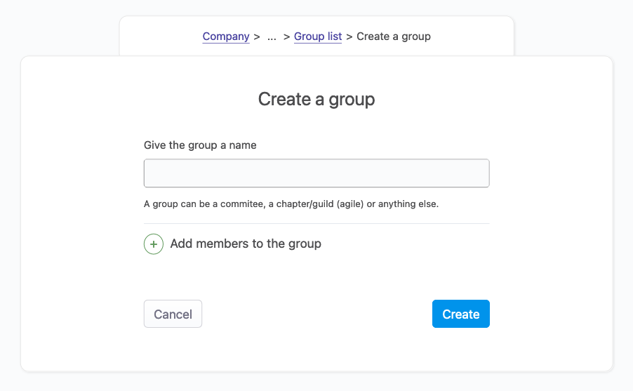
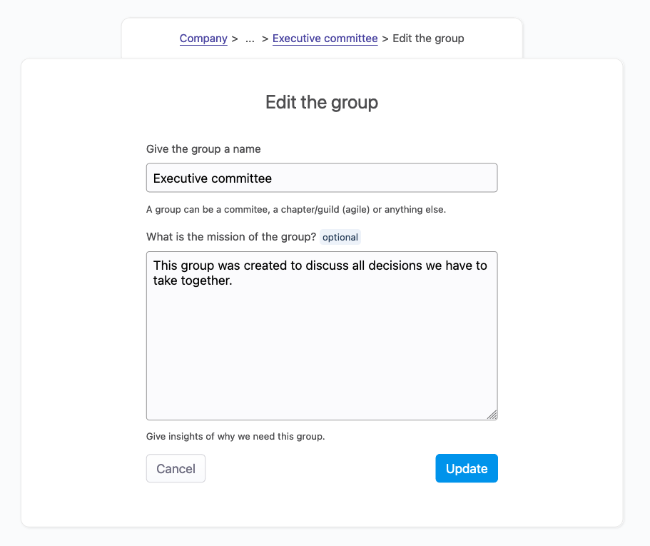

# Management of groups

## Overview

A group is made of people. Like the concept of [teams](/documentation/manage/team-management), this is vague on purpose. It’s up to you to decide whether a group is a committee, a guild (from an agile point of view) or something else. Employees can be part of one or more groups.

Like teams, groups are public. It’s part of the philosophy of OfficeLife to encourage trust, transparency and collaboration. That means everyone in the company knows who is part of which group, what the group does, and what the people inside this group do.

What is the difference between a team and a group?

A team is composed of people that have the same goal and usually work on the same thing every day.

A group is composed of people that usually don't work on the same thing every day, but need to gather regularly to discuss things that they have a common interest about.

If we take a real world scenario, here is what we would say about this: Regis is a Director of mobile on the Mobile team, and is part of the Executive Committee group to discuss with other directors about the direction of the project.

Groups are also different from the teams in terms of features. The essential features of a group is the ability to record meeting notes in a convenient user interface, making it easy to store this information that is often lost.

## Anatomy of a group

A group has the following information:

- a name, ideally unique in the organization,
- a set of members,
- a mission.

The mission is the purpose of the group and will inform new and existing members what they need to know about the group.

A group lets people set a meeting agenda, that everyone in the company can consult, and record meeting notes.

### Creating a group

Creating a group is done within the Company tab. To create a group you need a name, and that's it. Optionally, you can already add members to this group when you create a group.

::: tip Rules
* A group can be created and managed by anyone in the company.
* We don't have any rules in place to prevent people from creating two groups of the same name - so be careful with this.
:::

### Updating group name and mission

To edit the name and the mission of the group, head over to the group, and use the bottom right link to edit the info.

Changes are effective immediately.

::: tip Rules
* Everyone in the company can edit the group name and mission, regardless of the permissions.
:::

### Deleting a group

To delete a group, use the link on the bottom right part of the Group page.

::: tip Rules
* Anyone can delete a group.
* When a group is deleted, we will immediately and permanently delete everything we knew about this group.
* Employees who were part of the group won't be deleted from the system.
:::

## Group meetings

When a group gathers (online or physically), it's useful to prepare a meeting agenda beforehand, and to record what was said during the meeting, and who were present.

Group meetings allow you to do exactly that.
