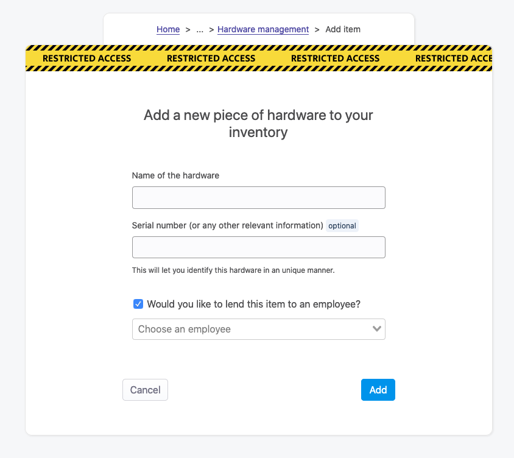
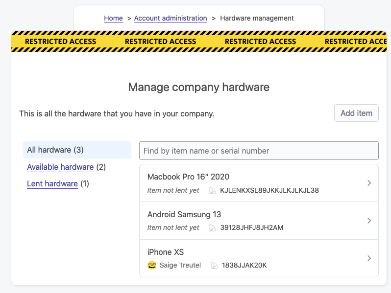

# Hardware inventory management

## Overview

Every company gives their employees some tools to work. Companies using OfficeLife are probably related to technology somehow, and if that's the case, they have laptops and desktops and mice and keyboards and cables that they give to their employees. Keeping track of who has what, and the company's inventory in general, can quickly become a mess. This is why OfficeLife provides companies with a straigthforward way of keeping track of hardware.

## How to manage hardware

The management of your hardware is done inside [Adminland](/docs/adminland).

### Create a new item

To create a new item, you need to specify its name. This is the only information that is required. However, you can also provide another information, labelled as serial number, to help you uniquely identify the object. You don't have to use this field to store the serial number per se, as you can enter whatever you want in it. The goal, really, is to help you identify the object.

Even though you can do it later, you can also associate this item to an employee right away. When you associate an item to an employee, this item will appear on the employee profile.

::: tip Rules
* Only employees with the HR or administrator roles can create an item.
* Both the name and the serial number fields are limited to 255 characters.
:::

### Listing all items

Sometimes you need to have an overview of all the hardware you have in your company. The hardware screen, by default, lists all the items in your company. It has 3 filters:

* one that displays all the items in the company
* one that shows only the items that have been given to employees,
* one that shows the items that are available.

Each line of the table shows the name of the item, its serial number if it’s defined, and the name of the employee this item belongs to, if applicable.

On this page you can also search a specific item by using the filter field above the list of items. Search here performs a partial or exact match, on the name or the serial number attributes.

### Hardware lent to an employee

Many items can be lent to an employee. Once an item is lent, it will appear on the employee's profile page.

::: tip Rules
* Only the employee who views his profile, or employees with the HR or administrator roles, can view the list of items lenan employee's profile page.
:::
