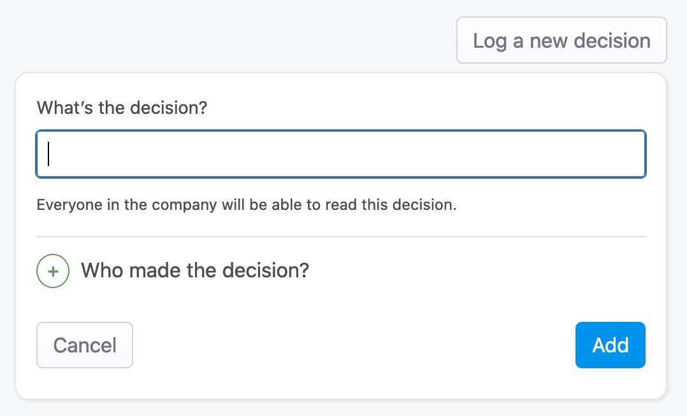
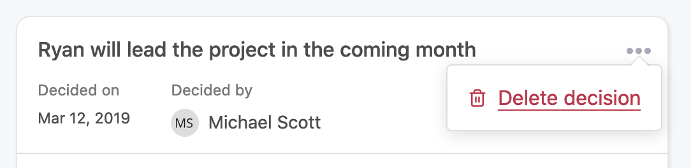
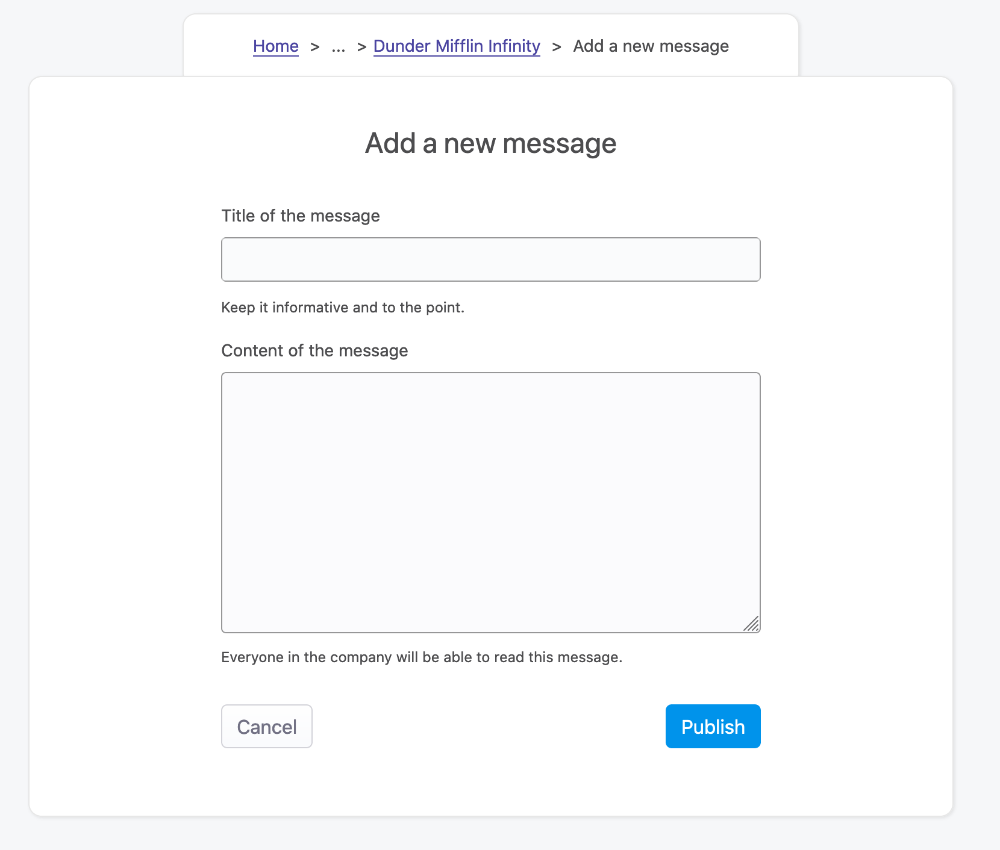
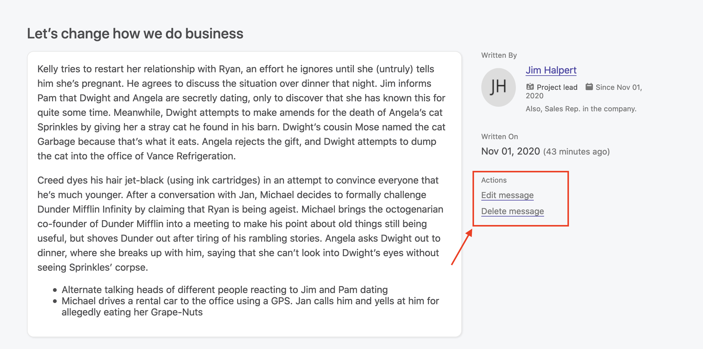
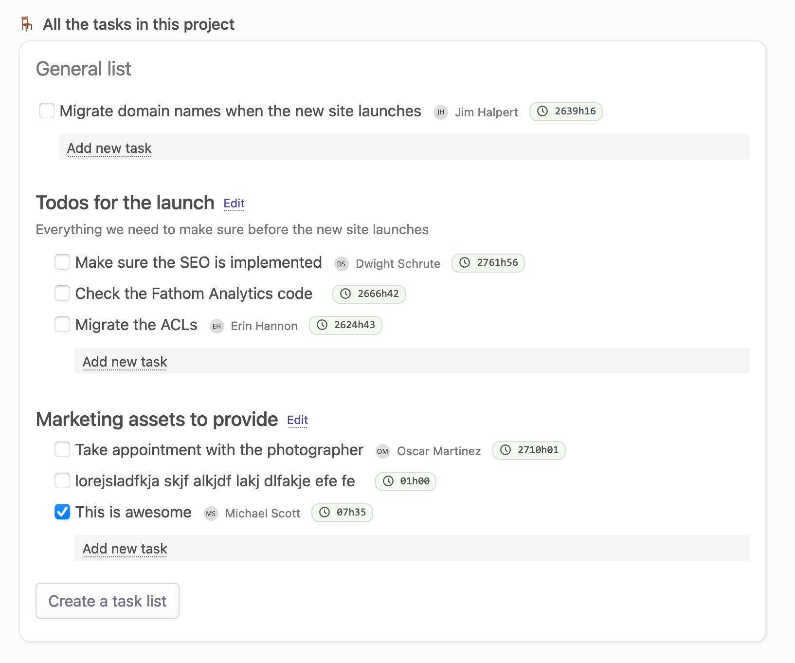
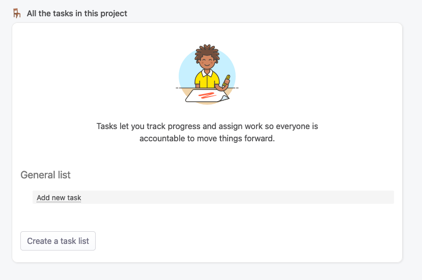
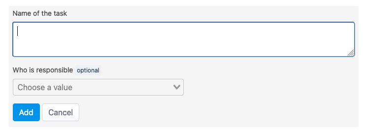
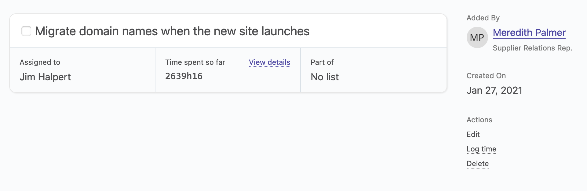

# Project management

## Overview

Projects are an essential part of any company. Most companies have projects that let them generate more money, or be more efficient, or else. For those companies, we want to provide a way to manage them inside OfficeLife, without having to use external, expensive tools. Moreover, we believe that having the notion of projects deeply integrated into the same tool as the one which manages employees and teams, is the best way to have a global overview of what's going on with the company, a team or an employee.

Project management is a very broad domain. There are a gazillion project management software out there. Our take on project management is to be simple to use, very powerful in terms of features, and integrate it closely with Finance, so we can have the complete overview of how a project is doing.

## Anatomy of a project

### Basics

A project, at its core, has

* a name,
* a summary, which is a one-liner that should let people understand very quickly the main goal of the project,
* a purpose, explained in details in the description,
* an emoji, representing the project (be creative and have fun with this 😀),
* optional start and end dates,
* a project lead, who will be responsible for it and the point of contact for everyone outside the project,
* employees who are part of this project, and each employee has a role inside this project.

A project has the following core features:

* statuses, so people can quickly see how the project is going in one look,
* messages, so people can share information,
* to-dos, so people know what to do and be accountable,
* dates in a calendar, so people can know when things are due,
* links, so people can know where they need to go.

### Project links

A project link is a way for project members, and people external to the project, to know what are the most important information of the project. Every project can have as many links as possible, but we advocate that you keep this number low and write the most important links that people need to understand the scope of the project.

As examples, those links could point to:

* a documentation,
* a link to the project itself,
* an important document that explains the scope of the project in details,
* and whatever is important to understand why we are doing this project.

#### Create a project link

To create a project link, you need to click on the Add a new link button.

### Project updates

When people land on the project page, they should be able to understand how the project is going in one quick look. This is where project updates come into play.

Project updates are written by the project lead, and only by the lead.

It contains:
* a status, that can be one of these
  * `on track`,
  * `late`,
  * `at risk`.
* a title,
* a description.

A good project update gives audience of all kind enough information to know it the project is fine or not.

You can’t read past project updates.

## Creating a project

### Rules

Anyone in the company can create a project.

To create a project, only one field is mandatory: the name of the project. This field has a 255 characters limit, and there are no restrictions otherwise on the name itself.

There are other optional fields:
* a project code,
* a summary,
* the possibility to assign a project lead.

Let's explain each of one these fields below.

### Project code

In some companies, projects are identified by a code. This is an internal information, used for either audit purposes, accounting purposes or any other internal purpose.

While this information is not required, we need to make sure that the chosen project code is unique within the company.

::: warning Note
You can’t have two projects with the same code in your company’s account.
:::

Also, this code has a 255 characters limit.

### Summary

The summary is meant to be a one-liner that explains what the project is. This summary is displayed on all the pages inside a project, as well as on the list of projects — hence the importance of having a simple, easy to understand sentence.

The summary accepts a maximum of 255 characters. This is on purpose - so we force people to be short and explanatory.

### Project lead

The project lead is the person responsible for the project. It doesn't have any special powers except the ability to manage what's happening inside the Finance tab of the project.

This information is displayed on the Summary page of the project and is meant to provide the information of who is ultimately responsible for the project.

## Deleting a project

If you delete a project, all information associated with it will be deleted as well. This includes time tracking entries - so be sure of your decision of deleting the project before proceeding.

## Project decisions

### Overview

In every project, lots of decisions are being made every day. Some are critically important, others are less important. The key, as always, is communication. When every decision is logged, communication improves, and less errors are made. Also, when everything is logged, we can relate to it later on.

OfficeLife allows everyone to log a project decision, simply and easily. It’s a simple but powerful feature.

The list of decisions is visible by anyone in the company. Remember: transparency is one of our core values at OfficeLife.

A project decision is composed of three pieces of information:

- what is the decision,
- when the decision has been made,
- who made the decision.

### Creating a project decision

To create a project decision, simply go to the Decisions tab on the project page.

Creating a decision only requires to indicate the decision itself. The decision can only have 255 characters.

However, you can, if you want, add who made the decision. We call it `deciders`. You can add as many deciders as you want, even if those deciders are not part of the project. Anyone in the company can be indicated here.

Once created, the decision will immediately appear in the list of decisions for this project.

Anyone in the company can create a decision for a project, even if he’s not part of the project.

### Deleting a project decision

Sometimes you need to delete a decision. To do so, simply use the menu next to each decision.

Anyone in the company can delete a decision.

## Project messages

### Overview

In the life of a project, there are decisions and tasks. But sometimes, you need to write things down to have a longer discussion that wouldn't fit in a task. Or you need to brainstorm. Or make an announcement. Or talk about any other topic.

This is where messages shine. It allows anyone in the company to create a message for everyone in the company to see (in the context of the project).

### List of messages

The Messages tab in a project shows all the messages in the project. The list keeps track of which messages you, as a user, have read or not.

### Creating a message

Creating a message is not restricted to members of the project. Why? Because sometimes, in a company, people from outside a project still want to be able to participe in a project without being officially in the project.

To create a message, only two fields are mandatory:

* the title of the message,
* its content.

Everyone in the company, and therefore the project, will be able to read this message once it’s created.

### Updating or deleting a message

To update or delete a message, use the options located in the bottom right corner when viewing a specific message.

Anyone in the company can update or delete a message.

## Project tasks

### Overview

Tasks are the central part of any project. This is how we know a project is moving forward. OfficeLife lets you easily manage tasks and assign them to project members, so projects are actually done.

A task can be part of a task list, or it can live outside of a list. It's easier to make it part of a list, though, so you can track progress towards a goal.

A task can also be assigned to someone. This lets people easily know who's responsible of what.

### List of tasks

The list of tasks shows the complete task lists and tasks in the project.

For each task, the list shows
* the task’s title,
* the assignee, if applicable,
* the overall time people have spent on this task.

Note that we can’t see the description (if it exists) of tasks in this view.

### Creating a task and a task list

By default, there are no lists in the project.

You can create lists in the project, or create simple tasks without lists.

You can assign someone as the person’s responsible for moving forward with the task.

::: tip Rules
* Only project members can be assigned as assignee.
* The title of the task is limited to 255 characters.
:::

### Viewing a task

To view a task’s details, click on the task title in a task list.

In this view, all the information about the task are displayed:
* the title and description,
* the assignee,
* the total time spent on the task by anyone,
* the list the task belongs to.

A project member can also
* edit or delete a task,
* add a time spent on the task.

Those three options are available on the sidebar.

If you log your time on a task, this time will be automatically logged on your timesheets as well.

### Updating or deleting a task

To update or delete a task, simply mouse-over the task, and click on the option you would like to do.

You can also go to the details of a task and select the Edit option on the right sidebar.
