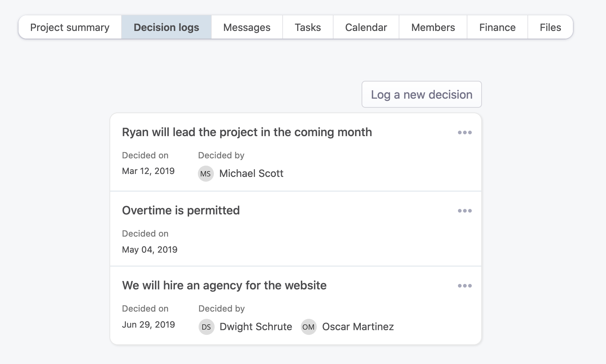
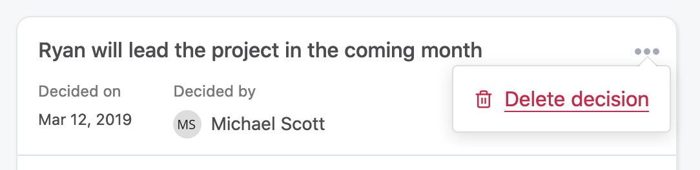

# Project management

## Overview

Projects are an essential part of any company. Most companies have projects that let them generate more money, or be more efficient, or else. For those companies, we want to provide a way to manage them inside OfficeLife, without having to use external, expensive tools. Moreover, we believe that having the notion of projects deeply integrated into the same tool as the one which manages employees and teams, is the best way to have a global overview of what's going on with the company, a team or an employee.

Project management is a very broad domain. There are a gazillion project management software out there. Our take on project management is to be simple to use, very powerful in terms of features, and integrate it closely with Finance, so we can have the complete overview of how a project is doing.

## Anatomy of a project

### Basics

A project, at its core, has

* a name,
* a summary, which is a one-liner that should let people understand very quickly the main goal of the project,
* a purpose, explained in details in the description,
* an emoji, representing the project (be creative and have fun with this 😀),
* optional start and end dates,
* a project lead, who will be responsible for it and the point of contact for everyone outside the project,
* employees who are part of this project, and each employee has a role inside this project.

A project has the following core features:

* statuses, so people can quickly see how the project is going in one look,
* messages, so people can share information,
* to-dos, so people know what to do and be accountable,
* dates in a calendar, so people can know when things are due,
* links, so people can know where they need to go.

### Project links

A project link is a way for project members, and people external to the project, to know what are the most important information of the project. Every project can have as many links as possible, but we advocate that you keep this number low and write the most important links that people need to understand the scope of the project.

As examples, those links could point to:

* a documentation,
* a link to the project itself,
* an important document that explains the scope of the project in details,
* and whatever is important to understand why we are doing this project.

#### Create a project link

To create a project link, you need to click on the Add a new link button.

### Project updates

When people land on the project page, they should be able to understand how the project is going in one quick look. This is where project updates come into play.

Project updates are written by the project lead, and only by the lead.

It contains:
* a status, that can be one of these
  * `on track`,
  * `late`,
  * `at risk`.
* a title,
* a description.

A good project update gives audience of all kind enough information to know it the project is fine or not.

You can’t read past project updates.

## Creating a project

### Rules

Anyone in the company can create a project.

To create a project, only one field is mandatory: the name of the project. This field has a 255 characters limit, and there are no restrictions otherwise on the name itself.

There are other optional fields:
* a project code,
* a summary,
* the possibility to assign a project lead.

Let's explain each of one these fields below.

### Project code

In some companies, projects are identified by a code. This is an internal information, used for either audit purposes, accounting purposes or any other internal purpose.

While this information is not required, we need to make sure that the chosen project code is unique within the company.

::: warning Note
You can’t have two projects with the same code in your company’s account.
:::

Also, this code has a 255 characters limit.

### Summary

The summary is meant to be a one-liner that explains what the project is. This summary is displayed on all the pages inside a project, as well as on the list of projects — hence the importance of having a simple, easy to understand sentence.

The summary accepts a maximum of 255 characters. This is on purpose - so we force people to be short and explanatory.

### Project lead

The project lead is the person responsible for the project. It doesn't have any special powers except the ability to manage what's happening inside the Finance tab of the project.

This information is displayed on the Summary page of the project and is meant to provide the information of who is ultimately responsible for the project.

## Project decisions

### Overview

In every project, lots of decisions are being made every day. Some are critically important, others are less important. The key, as always, is communication. When every decision is logged, communication improves, and less errors are made. Also, when everything is logged, we can relate to it later on.

OfficeLife allows everyone to log a project decision, simply and easily. It’s a simple but powerful feature.

The list of decisions is visible by anyone in the company. Remember: transparency is one of our core values at OfficeLife.

A project decision is composed of three pieces of information:

- what is the decision,
- when the decision has been made,
- who made the decision.

### Creating a project decision

To create a project decision, simply go to the Decisions tab on the project page.

Creating a decision only requires to indicate the decision itself. The decision can only have 255 characters.

However, you can, if you want, add who made the decision. We call it `deciders`. You can add as many deciders as you want, even if those deciders are not part of the project. Anyone in the company can be indicated here.

Once created, the decision will immediately appear in the list of decisions for this project.

Anyone in the company can create a decision for a project, even if he’s not part of the project.

### Deleting a project decision

Sometimes you need to delete a decision. To do so, simply use the menu next to each decision.

Anyone in the company can delete a decision.
