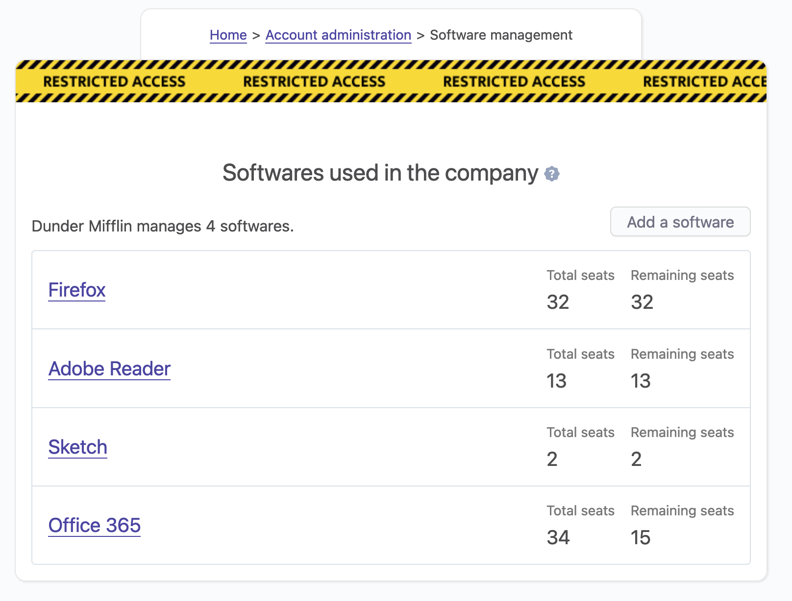
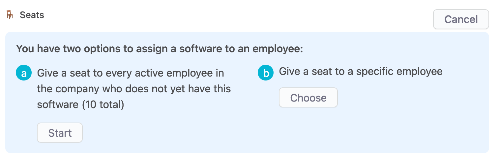
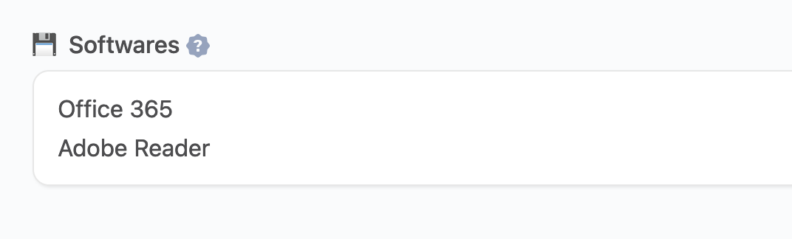

# Softwares management

## Overview

Every company needs to give softwares to their employees. OfficeLife makes it easy to manage software licenses and seats, so you know at all times who has what.

## How to manage softwares

The management of your softwares is done inside [Adminland](/docs/adminland).

### Create a new software

To create a new software, we need three information
* the name of the software,
* the product key,
* the number of seats.

Then, OfficeLife offers the possibility to indicate other details, such as
* the website the software has been bought from,
* the name and email the software is licensed to,
* the order number,
* the cost of the software as well as the currency,
* the purchase date.

Note that if you specify a price in a currency that is different than the [currency used in the company](/documentation/manage/company-management.html#currency), OfficeLife will automatically convert the currency to the company currency.

::: tip Rules
* Only employees with the HR or administrator roles can add a software.
:::

### Listing all softwares

In Adminland > Manage softwares, we will find the list of all the softwares tracked with OfficeLife.

Every software is listed with the number of total seats, and the number of remaining seats.

Sometimes, you will see a negative number associated with the remaining seats. This is intentional. For now, we will not limit the number of seats you are allowed to assign to employees. If there are only 30 seats and 35 are assigned, the system will let you do that - but it will warn you.

### Assign a seat to an employee

As you can see in the screenshot below, there are two ways to assign seats.

The first one is to assign seats one by one. In this mode, you will have to find an employee by name, and select it to assign a seat.

The second option is to mass assign seats to all employees who don't have the software yet. When doing this, OfficeLife will warn you if the number of employees who needs the software exceeds the number of available seats (as shown below).

If you agree to this, for sure the number of remaining seats will be negative.

Once assigned, the software will appear on the profile page of the affected employee, as shown below.

### Add a file

Sometimes it's helpful to store files in the context of a software. You could for instance store an ISO file that is linked to the software, and OfficeLife could host this image for you.

There are some interesting discussions about this feature [here](https://github.com/officelifehq/officelife/discussions/1062).

To associate a file with a software, you need to create the software first. Then, on the software details page, you have access to a section that lets you upload a file.

::: tip Rules
* There is no restriction on the size of the file you can upload. However, please, do not store huge files (over 1Gb). OfficeLife is not meant for that.
:::
