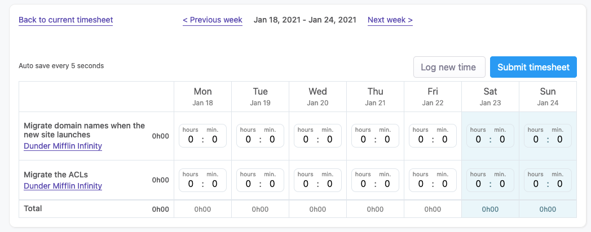
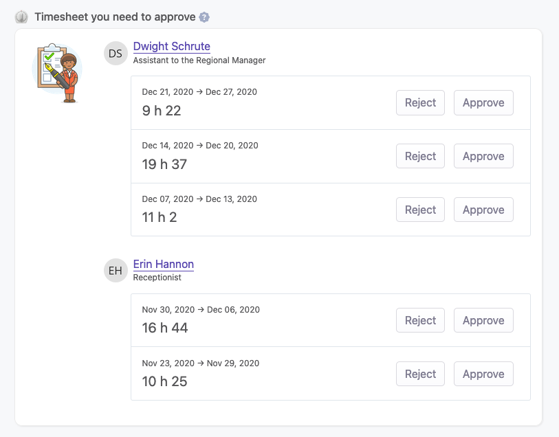
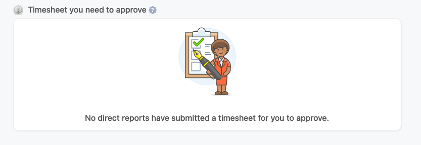

# Time tracking

## Overview

Time tracking is an essential piece of information for most companies. It gives the ability to know where the focus of an employee, a team or the entire company currently is. It also helps to understand the financial health of a project, especially if those projects have a fixed budget. Finally, and last but not least, if we combine time tracking with the worklogs feature, and/or the employee morale, this will give us unique insights on how the employee performs, or how he struggles so we can help him.

## How does time tracking work in OfficeLife

Like everything we do in OfficeLife, we try to keep features as simple as possible. Time tracking is no different - it’s simple to understand, simple to use and works as you think it works.

### Timesheets and time tracking entries

Time tracking is about timesheets.

A timesheet is a list of time tracking entries. An entry is a number of hours spent on something. Each time tracking entry must be associated to a specific task within a project. That means we need at least one project with at least one task to be able to use the time tracking feature.

All employees in OfficeLife can use the time tracking feature, as it’s enabled by default on every company’s account.

### Statuses

A timesheet has several statuses over the course of its lifetime:

* open,
* ready to submit,
* approved or rejected.

Every week, employees must submit their timesheets. If an employee has a manager, the timesheet needs to be approved by the manager. If the employee doesn't have a manager, the timesheet is automatically approved upon submission.

### Privacy

Like with every other features in OfficeLife, privacy has been taken into account when designing this feature. No regular employees can see someone else’s timesheets. Only employees with a specific right can read them:

* the manager of the employee, if defined,
* employees with HR or admin roles,
* employees with the Accountant role.

### Where do time tracking entries appear?

While an employee creates an entry on his dashboard, time tracking entries appear on several places in OfficeLife:

* on the Employee’s own page,
* on the Employee’s dashboard,
* on the Manager’s dashboard page,
* on the Finance tab on the Project page, if those entries are about a given project,
* on the Finance tab on the Company page.

## Creating a time tracking entry

There are several ways to log time in OfficeLife:

* on the employee’s dashboard,
* in a project.

### Creating a time tracking entry on the employee’s dashboard

To create an entry, an employee needs to enter:

* a duration: the duration is written in hours and minutes. While OfficeLife will make sure that this duration doesn't exceed 24 hours, it won't limit employees otherwise.
* a project and a task: those fields are necessary.

By default, a timesheet is empty, without any rows as shown below:

Using the button located on the upper right part of the screen, you can add a row in this timesheet. Each row represents a unique task, as shown below.

You can add as many rows (ie. project tasks) as you want - but on a single timesheet, every task can only appear once, and will disappear from the list of available tasks when adding a new row if you choose this task.

If there are no projects that you (as an employee) are not part of, or if there are no projects in the company at all, you won't be able to add a row in your timesheets.

OfficeLife will make sure that you can not enter more than 24 hours for all entries in a given day.

## Submitting a timesheet

When you are satisfied with your timesheet, you can simply submit the timesheet for validation, and the timesheet will be marked as `Waiting for approval`.

If you have a manager, he/she will be warned and will have to validate the timesheet after you’ve submitted it. If you don’t have a manager, someone in HR or with the accountant role will be able to validate the timesheet.

## Approving/rejecting a timesheet

### As a manager

If you are a manager, you must approve or reject a timesheet before it’s available to the other departments (like the Accounting or HR departments). When you are a manager, you have access to a special tab on the dashboard, called `Manager area`.

As soon as one of your direct report submits a timesheet, you will see them on this tab, as shown below.

Each row in this table will disappear as soon as you take a decision to either approve or reject a timesheet.

When there are no more timesheets to approve, OfficeLife will simply show a nice empty state.

