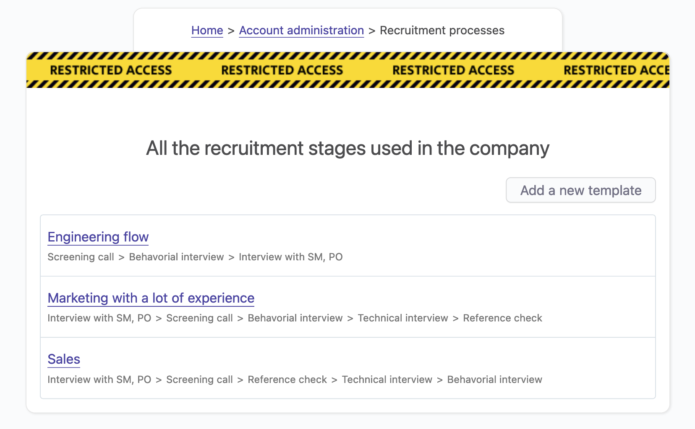
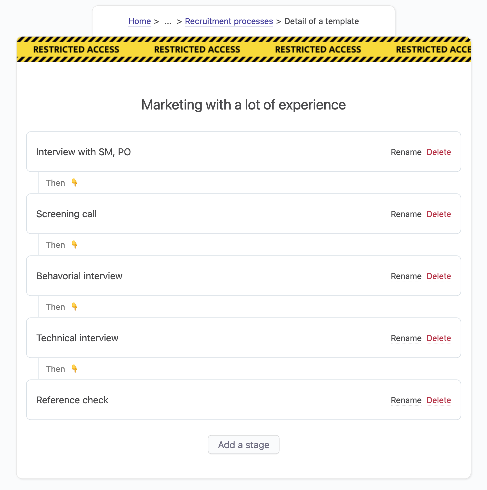

# Applicant tracking system

## Overview

OfficeLife's mission is to manage the entire employee lifecycle, which actually starts at the recruiting stage.

Since we manage everything that's going on with an employee in the company, it makes sense to manage the recruitment as well. In the HR world, these kinds of features are called an Applicant Tracking System, or <acronym title="Applicant Tracking System">ATS</acronym>.

Like everything we do, we will focus on what an <acronym title="Applicant Tracking System">ATS</acronym> is all about, and skip features that are less often used. Here is basically how recruiting works with OfficeLife:

* someone with the HR role creates a job opening, which is always linked to an [existing job position](/documentation/manage/employee-management.html#employee-positions),
* a job opening consists of:
  * a title,
  * a content,
* a job opening is sponsored by someone in the company (usually the manager of the team which recruits but it can be anyone in the company),
* job openings can be managed by someone with the HR or administrator role, or by the sponsor of this opening,
* all the job openings are public (on the internet) and can be consulted by anyone in the world at an URL that is unique to the company's account,
* someone will apply to the job opening by submitting his CV and some relevant information,
* when someone applies, the relevant employees can see it and take actions to interview the candidate,
* candidates can go through any number of phases that the company needs - those phases are called recruiting stages,
* once the company wants to hire the candidate, an offer is made, and once accepted, the candidate can be transformed into an employee in the system,
* the job opening can be closed, and the new employee can use OfficeLife as a new employee.

## Setting up the recruitment process

### The recruiting stages and templates

Every company is different, and OfficeLife lets you define a recruitment process that matches your unique use cases.

Say you have two different job openings, one for the role of Developer and the other for the role of Support specialist. Chances are that the recruiting process will be different for each job opening. For a developer, you might want to have multiple passes of interviews with other developers, then meet with the VP of Engineering, and finally, pass a technical test. For a support specialist, you might want to have a more relaxed process.

This is why we need to be able to create different templates to match the different unique use cases that will happen in your company.

A recruiting template is composed of stages, that we call *recruiting stages*.

OfficeLife lets you define templates of recruiting stages, so when you create a job opening, you can select the appropriate recruiting stages according to this template.

As you can see above, each template is composed of different stages. If you click on a template, you can see the details of the template, as shown below.

### Creating a new recruiting stage template

Recruiting templates are created under Adminland > Recruiting. To create a template, click on the `Add new template` button and enter a name.

::: tip Rules
* Only employees with the HR or administrator roles can create a template.
* The name of the template is limited to 191 characters.
:::

### Renaming and deleting a template

To rename or delete a template, go to Adminland > Recruiting, and click on the Rename or Delete button. If the template is being used by one or more job openings, changes will be effective immediately.

### Adding stages to a recruiting template

By default, a template is empty. It's up to you to add as many stages as you need for your specific context.

To add a stage, you can use the `Add a stage` button.

::: tip Rules
* Only employees with the HR or administrator roles can create a stage.
* The name of the stage is limited to 191 characters.
:::
